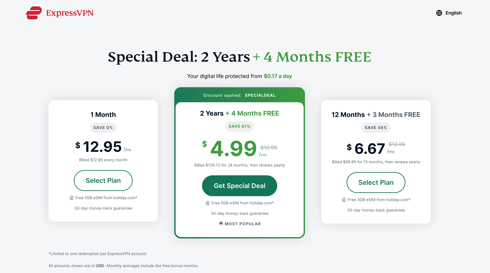
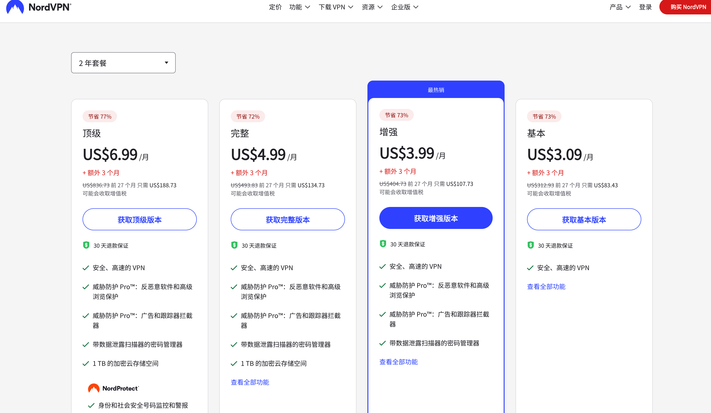
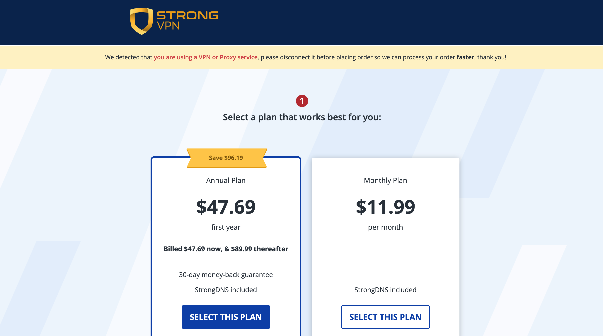

# 🌐 2025 年度最推荐 VPN 工具榜单（专为中国用户优化）

欢迎来到 ChatGPT 中文助手站点旗下的 VPN 推荐项目！  
本项目专为中国大陆用户精心打造，帮助你轻松突破网络限制，访问 ChatGPT、Google、YouTube、GitHub、Notion、Netflix 等全球顶级平台。

我们根据稳定性、速度、设备兼容性、匿名性、支持 ChatGPT 的能力等维度，对主流 VPN 工具进行横向评测，并附上可靠的注册与购买指南，方便你快速上手。

---

## 为什么一定要用 VPN？（场景越多，越刚需）

> **一句话：VPN 是数字世界的万能通行证。**  
> 在中国大陆/部分校园或企业网络环境里，以下日常场景都会被 GFW 或局域网策略阻断，只有借助 VPN 才能顺畅完成。

| 典型场景 | 受限现象 | 使用 VPN 后能做什么 |
|----------|----------|--------------------|
| **AI 与开发** | ChatGPT / Claude / GitHub Copilot 无法登陆或超时 | 注册 ChatGPT、订阅 Plus、调用 API、下载 GitHub 仓库 |
| **影视娱乐** | Netflix / Disney+ / Hulu / HBO Max 首页空白 | 解锁全球剧集；观看 YouTube 4K/8K、Bilibili 港澳台 |
| **搜索学习** | Google Scholar / arXiv / Hugging Face 403 | 查论文、下模型、看英文技术博客与官方文档 |
| **远程办公** | Zoom / Slack / Trello 经常掉线 | 稳定视频会议、文件同步与 Jira 工单 |
| **支付/电商** | PayPal、Stripe Dashboard、AWS Console 登录异常 | 绑定外币卡、管理云服务器、海淘比价 |
| **跨国游戏** | Steam 国区锁、Ping 爆炸 | 匹配国际服，解锁地区限定 DLC |

---

## VPN vs SS/Clash 机场：全面对比

| 维度 |  VPN（付费商业）  |  SS/V2Ray 机场（订阅节点）  |
|------|-------------------------|-----------------------------------|
| **流量加密** | 系统级全流量 + 256‑bit AES（OpenVPN / WireGuard / Lightway） | 单端口节点，易被墙 DPI 识别 |
| **客户端** | 一键安装，iOS/Android/macOS/Win/Linux/路由器全覆盖 | 需手动导入订阅 → Clash / Shadowrocket |
| **稳定性** | ✅ 企业级专线，自动选路；24 × 7 监控 | ⚠️ 取决于机场主 + 机房质量 |
| **同时连接数** | 5 – ∞ 取决于套餐 | 视机场规则，常见 3‑5 条 |
| **隐私合规** | 多数通过独立审计，欧美数据保护法约束 | 机场多为匿名个人运营，日志透明度低 |
| **面向人群** | 新手 / 跨境商务 / 内容创作者 | 高流量下载 / 技术玩家 / 备用线路 |
| **典型成本** | \$2.3 – \$12 /月（长约价） | ¥9 – ¥49 /月 |

> **最佳实践：** 先用 VPN 完成注册与支付 → 再用机场日常下载或测速，做到“主干 VPN + 末端机场”双保险。

---

## 购买 VPN 前必须关注的 9 大指标

1. **能否稳定解锁 ChatGPT / Netflix**（不只是官网，而是长时间可用）  
2. **协议与速度**：OpenVPN、WireGuard、Lightway、NordLynx；是否自研/私有加速协议  
3. **服务器网络**：国家/地区数量 + 专用流媒体/P2P/游戏节点  
4. **隐私政策**：无日志声明是否通过 **第三方独立审计**；是否采用 **RAM‑only Server**  
5. **中国可用性**：是否内置混淆/隐匿协议；是否提供镜像站和离线安装包  
6. **终端数量**：同时连接 5 台还是无限；是否支持路由器/Apple TV/Play Station  
7. **附加功能**：广告 & 恶意域名拦截、Split‑Tunneling、专属 IP、端口转发  
8. **价格 + 退款**：月付 vs 1/2/3 年长约；是否 30 天无理由退款；支持支付宝/虚拟卡/USDT  
9. **中文客服 & 文档**：是否有 24×7 Live Chat / 邮件支持，文档是否中文友好

---

## 🆓 免费跳板推荐：V2Free 免费机场

如果你连 VPN 官网或 ChatGPT 都打不开，我们推荐你先用一个免费的机场作为跳板,每日可领取免费流量：

👉 [点击这里注册 V2Free（每日免费流量）](https://w1.v2free.cc/auth/register?code=i0A3)

使用 V2Free 可访问：
- ChatGPT 官网
- OpenAI 注册页
- 各大 VPN 官方网站

---

## 🛡️ 深度评测：2025 年度五大 VPN 服务

下面汇总了五款常见 VPN（ExpressVPN、Surfshark、NordVPN、Private Internet Access、StrongVPN）的详细参数与实测表现，帮助你快速选出最适合访问 ChatGPT、YouTube、GitHub 等海外服务的方案。

---

### 1. ExpressVPN

**安全与加密**  
ExpressVPN 采用 256‑bit AES 加密 和 ChaCha20 算法，支持 OpenVPN（TCP/UDP）、IKEv2/IPSec 以及自研的 Lightway 协议。Lightway 以速度快、连接稳定著称，还提供 NAT 心跳功能，提升移动端通知及时性。

**隐私保护**  
坚持严格的无日志政策，并已通过多次独立审计。所有服务器均运行在 RAM-only 架构上，一断电即清除所有数据，彻底防止日志泄露。

**网络规模**  
在 94+ 个国家/地区拥有 3000+ 台服务器，覆盖 160 多个城市。全球节点丰富，可就近连接以获得最佳速度。

**速度实测**  
在千兆线路测试中，ExpressVPN 的平均速度损耗不足 10%，大多数地区下载速度可达 450–500 Mbps，延迟极低。

**流媒体解锁**  
可稳定解锁 Netflix、Disney+、Amazon Prime Video、BBC iPlayer、Hulu 等主流流媒体平台。

**特色功能**  
- MediaStreamer DNS：智能解锁不支持客户端的设备（如智能电视、游戏机）  
- Split Tunneling：可针对特定应用或域名选择走 VPN 或直连

**价格方案**  
- 年付：$6.67/月（含 49% 折扣 + 3 个月免费）  
- 月付：$12.95/月  
- 全部套餐均享 30 天无理由退款保障

**优点**  
- 顶级速度与稳定性  
- 行业领先的安全架构与审计  
- 杀手级流媒体解锁能力

**缺点**  
- 价格偏高  
- 不内置广告/恶意软件拦截
  
| **ExpressVPN**  👉 [点击注册](https://www.expressvpn.com/) |

 
---

### 2. Surfshark

**安全与加密**  
Surfshark 使用 256‑bit AES‑GCM 加密，支持 WireGuard、OpenVPN、IKEv2/IPSec 协议。内置 CleanWeb 广告和恶意网站拦截，提供 MultiHop（双 VPN）和 NoBorders 模式，自动规避审查。

**隐私保护**  
严格无日志，经独立安全团队审计，支持加密货币和苹果礼品卡支付，保障最高匿名性。

**网络规模**  
在 100+ 个国家/地区运营 3200+ 台服务器，所有服务器均允许 P2P 流量。

**无限设备连接**  
支持无限台设备同时登录，家庭和多设备用户理想之选。

**速度实测**  
基于 WireGuard，下载速度平均可达 400+ Mbps，高清视频流畅无缓冲。

**流媒体解锁**  
可稳定访问 Netflix、HBO Max、BBC iPlayer、Disney+、Amazon Prime 等。

**特色功能**  
- Bypasser（分流）：为特定网站或应用排除 VPN  
- IP Rotator：定时更换 IP，提升匿名性  
- Smart DNS：兼容不支持 VPN 的设备

**价格方案**  
- 两年套餐：$2.49/月（含 30 天退款）  
- 一年套餐：$3.99/月  
- 月付：$12.95/月

**优点**  
- 极高性价比  
- 无设备数量限制  
- 功能丰富，适合进阶用户

**缺点**  
- 部分高级功能对新手略显复杂

| **Surfshark**  👉 [点击注册](https://surfshark.com/zh) |

---

### 3. NordVPN

**安全与加密**  
NordVPN 支持 AES‑256‑GCM，加自研 NordLynx（基于 WireGuard）协议，同时兼容 OpenVPN、IKEv2/IPSec。提供双重 VPN、Onion Over VPN 和服务器混淆功能。

**隐私保护**  
严格无日志政策，已通过 PwC 等第三方审计，定期发布透明度报告。

**网络规模**  
拥有 6000+ 台服务器，遍布 111 个国家/地区，含专门的 P2P、混淆及加速节点。

**速度实测**  
使用 NordLynx 协议，速度可达 480–520 Mbps，延迟 <20 ms，稳定性优秀。

**流媒体解锁**  
全平台解锁 Netflix、Disney+、Hulu、Amazon Prime、BBC iPlayer。

**P2P 与 Torrent**  
支持所有标准节点的 P2P，内置 Kill Switch，配合 SOCKS5 代理可进一步提升下载速度。

**特色功能**  
- Threat Protection：广告/恶意软件拦截与应用漏洞扫描  
- Meshnet：创建安全私有网络，实现跨地域设备访问  
- CyberSec：增强网络威胁防护

**价格方案**  
- 两年套餐：$3.09/月  
- 一年套餐：$4.99/月  
- 月付：$11.99/月

**优点**  
- 功能最全面  
- 节点数量丰富  
- 出色的 P2P 和流媒体表现

**缺点**  
- 短期方案价格较高  
- 部分功能对新手不够友好

| **NordVPN**  👉 [点击注册](https://nordvpn.com/zh/) |

---

### 4. Private Internet Access (PIA)

**安全与加密**  
支持 AES‑128 和 AES‑256 加密，提供 WireGuard、OpenVPN、IKEv2/IPSec 协议。内置 MACE 广告/恶意软件拦截，支持 SOCKS5 代理和端口转发。

**隐私保护**  
严格无日志，多次司法审查中未留任何敏感数据。所有客户端开源，接受社区监督。

**网络规模**  
35000+ 台服务器，覆盖 91 个国家/地区，并配置专门 P2P 优化节点。

**无限设备连接**  
支持无限台设备同时使用。

**速度实测**  
WireGuard 下速度可达 400+ Mbps，OpenVPN 下稳定在 200–300 Mbps。

**流媒体解锁**  
兼容 Netflix、Hulu、Amazon Prime、BBC iPlayer。

**特色功能**  
- 定期发布透明度报告  
- 支持匿名加密货币支付  
- 高度可自定义客户端

**价格方案**  
- 两年套餐：$2.03/月  
- 一年套餐：$3.33/月  
- 月付：$11.95/月

**优点**  
- 隐私审计背书强  
- 超高性价比  
- 强大的 P2P 性能

**缺点**  
- 公司总部在美国（受 5/9/14 眼联盟影响）  
- 高级配置对非技术用户略有门槛

| **PIA VPN** 👉 [点击注册](https://www.privateinternetaccess.com/) |

---

### 5. StrongVPN

**安全与加密**  
提供 AES‑256 加密，支持 WireGuard、OpenVPN、IKEv2/IPSec 协议。内置 Kill Switch，无日志且无 IP/DNS/WebRTC 泄漏。

**隐私保护**  
无日志政策，总部位于美国，但因无存储日志而难以被法令索取。

**网络规模**  
950 台服务器，分布在 30+ 个国家/地区，覆盖 59 个城市。

**速度实测**  
- WireGuard：270–300 Mbps（美国节点），450–500 Mbps（英国节点）  
- IKEv2：260–280 Mbps  
- OpenVPN：230–240 Mbps

**流媒体解锁**  
支持访问 Netflix US、Disney+、Amazon Prime，但对 BBC iPlayer 和部分地区 Netflix 支持有限。

**P2P 与 Torrent**  
所有服务器均允许 P2P，附赠 250 GB SugarSync 云存储，用于文件备份。

**特色功能**  
- SugarSync 云存储（250 GB）  
- 支持最多 12 台设备同时连接  
- 全套路由器安装指南

**价格方案**  
- 年付：$3.66/月（\$43.92/年）  
- 月付：$10.99/月

**优点**  
- 云存储附加值  
- 多平台支持  
- 稳定的 P2P 体验

**缺点**  
- 节点数量相对较少  
- WireGuard 速度低于顶级对手  
- 缺少浏览器扩展

| **StrongVPN** 👉 [点击注册](https://strongvpn.com/) |

---

## 📊 VPN 对比一览

| 服务      | 加密算法       | 协议支持                      | 服务器覆盖           | 连接数        | 价格（长期）      | 流媒体解锁       | P2P 支持       | 特色功能                                       |
|-----------|---------------|------------------------------|----------------------|--------------|------------------|-----------------|----------------|------------------------------------------------|
| ExpressVPN| AES-256,ChaCha20 | Lightway, OpenVPN, IKEv2    | 3000+／94+ 国       | 8            | \$6.67/月（年付）| 顶级（Netflix 等）| ✅             | TrustedServer, MediaStreamer, Split Tunneling |
| Surfshark | AES-256-GCM   | WireGuard, OpenVPN, IKEv2    | 3200+／100+ 国      | ∞            | \$2.49/月（2年） | 优秀（Netflix、HBO）| ✅             | CleanWeb, MultiHop, IP Rotator, Smart DNS     |
| NordVPN   | AES-256-GCM   | NordLynx, OpenVPN, IKEv2     | 6000+／111+ 国      | 10           | \$3.09/月（2年） | 优秀（全平台）     | ✅             | Threat Protection, Meshnet, Onion Over VPN    |
| PIA       | AES-128/256   | WireGuard, OpenVPN, IKEv2    | 35000+／91+ 国      | ∞            | \$2.03/月（2年） | 良好（大多数）    | ✅             | PIA MACE, Port Forwarding, Open Source        |
| StrongVPN | AES-256       | WireGuard, OpenVPN, IKEv2    | 950／30+ 国         | 12           | \$3.66/月（年付）| 良好（Netflix）| ✅             | SugarSync (250 GB), Router Guides             |

---

## 📚 推荐配套教程

- [📝 ChatGPT 注册流程（免手机号）](https://chatgpt-helper-tech.github.io/chatgpt-register-guide/)
- [💳 ChatGPT Plus 升级教程](https://chatgpt-helper-tech.github.io/chatgpt-plus-guide/)
- [✈️ 科学上网 机场 推荐榜单](https://chatgpt-helper-tech.github.io/airport-access/)
- [📘 中文导航主站](https://chatgpt-helper-tech.github.io)

---

📬 本项目由 [chatgpt-helper-tech](https://github.com/chatgpt-helper-tech) 维护  
如果你觉得内容实用，欢迎 ⭐Star 支持项目，让更多人学会科学上网 + 聪明使用 ChatGPT！
