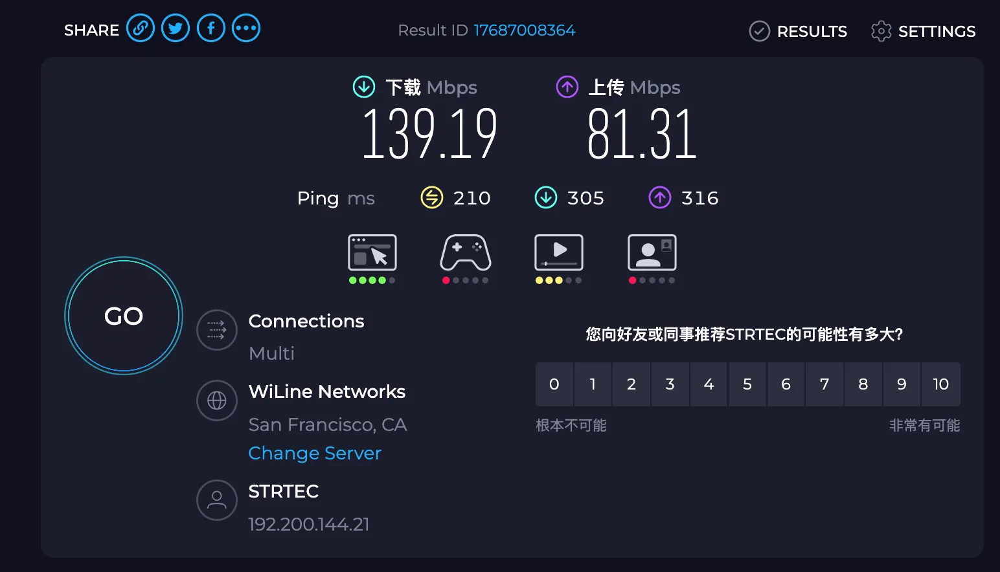

# VPN推荐榜单｜2025年10月更新 | 中国实测可用 | 稳定高速

---

## 🎯 为什么选择我们的推荐？

| 优势 | 说明 |
|------|------|
| ✅ **真实测试** | 所有 VPN 均在中国大陆环境下实测，确保可用 |
| ✅ **每月更新** | 测速数据、价格信息、可用性持续跟踪 |
| ✅ **无风险试用** | 推荐的 VPN 均支持 30 天退款保证 |
| ✅ **专业评测** | 从速度、隐私、易用性等多维度深度评估 |

---

## 📢 重要提示

> **⭐ 觉得有帮助？请点击右上角 Star 支持项目，让更多人找到可用的 VPN！**

> **📱 墙内访问 GitHub 较慢？**  
> 访问官网镜像获得更好体验：👉 **[gptvpnhelper.com/network-access/](https://gptvpnhelper.com/network-access/)**

---

## 🚀 快速开始

欢迎访问 **[ChatGPT 中文助手导航站](https://gptvpnhelper.com)** 出品的 VPN 实测推荐项目！

我们深耕科学上网领域 **3年+**，累计测试 **30+ 款 VPN 服务**，为中国大陆用户筛选出真正可用、稳定、高速、安全的翻墙工具。

### 📊 评测维度

| 评测项目 | 说明 |
|---------|------|
| 🔐 **中国可用性** | 能否稳定穿透 GFW，连接成功率如何 |
| ⚡ **速度表现** | 实测下载/上传速度，流媒体播放体验 |
| 🌍 **服务器覆盖** | 全球节点数量与分布，是否有亚洲节点 |
| 🛡️ **隐私安全** | 加密协议、无日志政策、独立审计 |
| 💰 **性价比** | 价格、退款政策、同时连接设备数 |
| 🎬 **流媒体解锁** | Netflix、YouTube、Disney+等平台支持 |
| 🤖 **AI 工具兼容** | ChatGPT、Claude、Midjourney 等访问 |

### 🎁 2025年10月特别优惠

- **[Surfshark](https://get.surfshark.net/aff_c?offer_id=926&aff_id=38237)**：2年套餐立省 **87%**，低至 **$1.99/月** + 无限设备 ⭐ **编辑推荐**
- **[NordVPN](https://get.affiliatescn.net/aff_c?offer_id=153&aff_id=122265&url_id=613)**：2年套餐享 **73% 折扣** + 额外赠送 **3个月**
- **[StrongVPN](https://strongvpn.com/?tr_aid=68066b25e52d2)**：年付套餐 **6.6折**，赠送 250GB 云存储

> 💡 **温馨提示**：所有推荐 VPN 均支持 30 天无条件退款，可放心试用

---

## 📖 目录

- [❓ 为什么一定要用 VPN?（场景越多，越刚需）](#whyneedvpn)
- [🥊 VPN vs SS/Clash 机场：全面对比，谁更适合你？](#-vpn-vs-ssclash-机场全面对比谁更适合你)
- [🎯 购买 VPN 前，必须掌握的 9 项关键指标（避坑指南）](#-购买-vpn-前必须掌握的-9-项关键指标避坑指南)
- [🆓 免费跳板机场推荐：百变小樱机场](#free)
- [🛡️ 深度评测：2025 年度 VPN 服务 TOP5](#fivebestvpn)
    - [1. Surfshark  推荐指数:⭐️⭐⭐⭐⭐](#Surfshark)
    - [2. NordVPN    推荐指数:⭐️⭐⭐⭐⭐](#nordvpn)
    - [3. StrongVPN 推荐指数:⭐️⭐⭐⭐](#strongvpn)
    - [4. PureVPN 推荐指数:⭐️⭐⭐⭐](#purevpn)
    - [5. Private Internet Access (PIA) 推荐指数:⭐️⭐⭐](#pia)

- [📊 VPN 对比一览](#-vpn-对比一览)
- [📚 推荐配套教程](#-推荐配套教程)

---

## 为什么一定要用 VPN ❓（场景越多，越刚需）

> **一句话总结：VPN 是数字世界的万能通行证。没有它，你寸步难行；有了它，世界皆通。**

我们不是在危言耸听，而是想问你几个简单的问题：
- 百度上搜不到答案？知乎水帖刷屏？国内平台“信息围城”越来越严重,Google 用不了?
- 你是不是连 ChatGPT 网页都打不开？
- 想看 YouTube,Netflix，却一直提示“无法连接”？
- GitHub 下载一个仓库，结果超时 3 次？
- 论文查找、AI 模型获取，打不开 Hugging Face、arXiv？
- Steam 区锁 DLC 买不了、Ping 高延迟爆炸？
- AWS Console 登录异常，Stripe/Paddle 无法绑定虚拟卡？

这一切，**不是你电脑的问题**，而是网络环境对你关上了门。

而 VPN，就是那把专属你的钥匙。

---

| 🧱 典型使用场景 | 🚫 常见受限现象 | ✅ 使用 VPN 后能做什么 |
|----------------|------------------|------------------------|
| **AI 与开发** | ChatGPT / Claude / GitHub Copilot 无法登录、响应超时 | 注册 ChatGPT、订阅 Plus、调用 API、拉取 GitHub 仓库 |
| **影视娱乐** | Netflix / Disney+ / Hulu / HBO Max 显示区域限制、加载失败 | 解锁全球流媒体；看 YouTube 4K/8K、B站港澳台番剧 |
| **搜索学习** | Google Scholar / arXiv / Hugging Face 403 拒绝访问 | 自由查阅英文论文、下载 AI 模型、访问国外开发文档 |
| **远程办公** | Zoom、Slack、Trello 掉线、同步失败 | 稳定视频会议、实时协作、Jira 工单不卡顿 |
| **支付/电商** | PayPal、Stripe、AWS 登录异常，虚拟卡绑不上 | 成功绑定外币卡，顺利管理云服务、下单跨境电商平台 |
| **跨国游戏** | Steam 国区锁，Ping 高、DLC 无法购买 | 解锁国际服内容、低延迟匹配、畅玩全球限定游戏 |

---

## 🧠 小结

如果你还在靠“免费机场”勉强访问 ChatGPT；  
如果你每次看 Netflix 都要碰碰运气；  
如果你买了台好电脑，却连一个 GitHub 项目都下不来；

那是时候认真对待“VPN”这件事了。

**选择对的 VPN，不只是更快更稳——而是让你彻底摆脱卡顿、封锁、和信息落差。**

👉 接下来，我们将带你深入了解 2025 年最值得使用的 VPN 工具，帮你**选得放心、用得安心、买得划算！**

---

## 🥊 VPN vs SS/Clash 机场：全面对比，谁更适合你？

很多人在选择“科学上网”方案时，会纠结 VPN 和机场（SS/V2Ray/Clash）哪个更好用？下面我们从安全性、稳定性、易用性、隐私保护等关键维度做一个一目了然的对比：

| 维度 | VPN（国际付费商业服务） | SS/V2Ray 机场（国内订阅节点） |
|------|--------------------------|-------------------------------|
| **流量加密** | ✅ 系统级全流量加密（AES-256，协议如 OpenVPN / WireGuard / Lightway），强抗封锁 | ⚠️ 多为单端口节点，易被 GFW DPI 主动识别封锁 |
| **流量限制**      | ✅ 基本不限流量，无需担心用量                                  | ❌ 按套餐限流量（如100GB/月、500GB/月），超出可能限速或断网         |
| **使用门槛** | ✅ 一键安装，免配置，iOS/Android/Win/Mac/路由器全支持 | ❌ 需手动导入订阅、设置 Clash 或 Shadowrocket，新手易踩坑 |
| **连接稳定性** | ✅ 企业级专线 + 全球智能选路，断线自动重连 | ⚠️ 节点质量不一，依赖机场主维护，晚高峰不稳定 |
| **同时连接设备** | 5–∞（取决于套餐，支持家庭/多设备共享） | 视机场限制，一般 2–5 个并发连接 |
| **隐私与合规** | ✅ 多数 VPN 通过第三方隐私审计，受欧美 GDPR 监管，无日志保障 | ❌ 多为匿名搭建，无审计、无说明、无保障，跑路风险高 |
| **适合人群** | 新手用户、留学跨境、程序员、AI内容创作者、跨境电商 | 技术玩家、下载党、测试党、备用选项 |
| **典型月费** | $2.3 – $12 / 月（长约折扣价） | ¥9 – ¥49 / 月（波动大，质量参差不齐） |

---

### ⭐ 专业良心建议

- > 🚀 **注重安全性和隐私保护，一定要选国外顶级 VPN,避免IP泄漏或者被监控**
- > 💡 **长期使用建议优先选择 VPN，性价比更高且不限流量。机场是按流量算,门槛低，但存在跑路风险，而国际大厂 VPN 稳定可靠，运营历史普遍超 10 年。**
- > 📥 **短期或偶尔使用可考虑机场，体验外网较为便捷。VPN 单月价格偏高，按年订阅更划算。**
- > 📺 **重度流媒体用户建议使用 VPN。机场流量有上限，观看流媒体 4K 视频消耗快，超额需额外付费，且速度通常不如 VPN 稳定。**

如果你是新手、跨境用户、内容创作者、AI开发者——**优先选 VPN 保命+省心+效率高**  
等熟练后可考虑搭配优质机场，实现“主干 VPN + 末端机场”双重保障，速度和自由都不落下！
- > 附上2025机场推荐评测: [ 点击跳转 ChatGPT 中文助手站 机场推荐](https://gptvpnhelper.com/airport-access)

---

📌 **结论很简单：**
- 想稳定、长期、安全，选大牌 VPN
- 想便宜、折腾、有备选，机场能用但风险自担

---

## 🎯 购买 VPN 前，必须掌握的 9 项关键指标（避坑指南）

市面上 VPN 品牌众多，但真正适合中国大陆用户的，其实不到 10%。如果你不想买完就封、用两天就卡、退款又麻烦，**请在下单前务必确认以下 9 项核心指标：**

---

1. **是否能稳定解锁 ChatGPT / Netflix / YouTube？**
   > 不只是能打开官网，而是能长时间保持连接、支持注册、付款、升级 Plus、不被封 IP。

2. **协议与速度表现如何？**
   > 是否支持 OpenVPN / WireGuard / Lightway / NordLynx 等现代协议？是否具备自研或私有加速协议以应对 GFW？

3. **全球服务器网络布局是否够广？**
   > 国家和地区节点是否丰富？是否设置专用的流媒体 / P2P 下载 / 游戏低延迟服务器？

4. **隐私政策是否可信？**
   > 是否明确“零日志”声明？有没有通过 **第三方独立审计**？是否采用 **RAM-only Server**（重启即清除数据）？

5. **是否对中国友好？**
   > 是否支持混淆协议、防 DPI？是否提供**镜像站**、离线安装包，解决“官网打不开”的尴尬？

6. **支持的终端数量和设备兼容性？**
   > 同时连接是 5 台还是无限？是否支持路由器、Apple TV、PS5、安卓盒子等多设备？

7. **附加功能是否实用？**
   > 如广告拦截、恶意域名屏蔽、Split Tunneling（分应用走代理）、专属 IP、端口转发等增强功能。

8. **价格合理 + 是否支持无理由退款？**
   > 支持月付/年付组合？有无 30 天退款保障？是否接受支付宝、虚拟卡、USDT 等灵活支付方式？

9. **是否提供中文客服与文档？**
   > 是否有 24×7 在线客服 / 邮件支持？技术文档是否对中文用户友好？是否有本地部署指引？

---

📌 **购买建议：**  
如果一个 VPN 连上述 3 项都无法满足，那就别买。别因为几块钱被卡得发疯。  
靠谱 VPN = 稳定穿墙 + 流畅体验 + 无痛退款。

👉 在下一节中，我们将推荐通过全部验证的 VPN 工具 —— 实测可用，长期稳定。

---

## 🆓 限时免费高端机场推荐：<a href="https://bbxy.xn--cesw6hd3s99f.com/auth/register?code=FFHk" target="_blank" style="color:#1a73e8;text-decoration:underline;">百变小樱</a>

### 🚀 无法访问 ChatGPT、YouTube、GitHub、VPN官网？先用这个免费机场恢复联网！

如果你当前处于**完全无法翻墙**的状态 —— 无法打开 ChatGPT、YouTube、Google、GitHub 或 VPN 官网，那么这款 **限时免费高端机场「百变小樱」** 是你最佳的起点选择。

📌 **强烈建议立即注册，恢复基础联网能力，体验顶级 IEPL 专线机场！**

---

### ✨ 为什么推荐「百变小樱」机场？

- ✅ **提供免费试用期**：注册1天内免费使用,可自行体验稳定性与速度,试错成本为0
- ✅ **稳定可靠**：运营超5年，团队位于海外，服务成熟稳定
- ✅ **高速专线**：接入顶级公网 IEPL 专线，低延迟、高速大带宽，游戏、下载、视频通通流畅无卡顿
- ✅ **灵活套餐**：支持免费试用，高中低档付费套餐灵活选择，按需升级更划算
- ✅ **兼容主流工具**：全面支持 Clash、Shadowrocket、SSR 等翻墙主流客户端一键导入，导入简单便捷
- ✅ **流媒体解锁能力强**：ChatGPT、YouTube、TikTok、Netflix、Disney+、HBO Max 等全解锁，支持 4K 串流
- ✅ **专属会员福利**：LV3 以上会员可获免费 Netflix、Disney+、Prime Video 等会员账号，4K 秒播！

---

> 🧠 **作者实测使用超过3年，稳定性极高**。日常办公、AI 使用、高清观影、海外游戏、跨境电商访问，**全场景表现优秀，值得长期使用**！

### 🔗 立即开启你的科学上网之路：

  <a href="https://bbxy.xn--cesw6hd3s99f.com/auth/register?code=FFHk" target="_blank" style="display: inline-block; padding: 12px 20px; background-color: #1E88E5; color: white; font-size: 16px; font-weight: bold; border-radius: 8px; text-decoration: none;">
    👉 免费注册百变小樱机场（限时开放中）
  </a>

🎁 1天试用期到期之后,若想购买付费套餐,购买套餐时可使用我们申请到的**专属95折优惠码: bbxy-5th**

---

> 💡 提示：科学上网的第一步是选择靠谱稳定的机场节点。**百变小樱作为新手推荐第一站，解决你“打不开 ChatGPT”的痛点**，是你通往自由互联网世界的起点。

---

## 🛡️ 深度评测：2025 年度 VPN 服务 TOP5

下面汇总了五款精选 VPN（Surfshark、NordVPN、StrongVPN、PureVPN、Private Internet Access）的详细参数与实测表现，帮助你快速选出最适合访问 ChatGPT、YouTube、GitHub、Steam 等海外服务的方案。
---
***************************************************************************************************************
---

---

### 1. 🏆 [Surfshark - 2025年最佳性价比 VPN](https://get.surfshark.net/aff_c?offer_id=926&aff_id=38237)（立省87%）

> **🌟 编辑推荐 | 综合评分：9.8/10**

| 项目 | 评分 | 评分理由 |
|------|------|----------|
| **推荐指数** | ⭐⭐⭐⭐⭐ | 综合实力最强，适合 95% 的用户 |
| **中国易用性** | ⭐⭐⭐⭐⭐ | 下载即用，无需配置，连接成功率 >95% |
| **价格** | ⭐⭐⭐⭐⭐ | $1.99/月起，性价比之王 |
| **速度** | ⭐⭐⭐⭐⭐ | WireGuard 协议，200+ Mbps 实测速度 |
| **流媒体** | ⭐⭐⭐⭐⭐ | 解锁 Netflix/YouTube/Disney+ 全球内容 |
| **安全隐私** | ⭐⭐⭐⭐⭐ | AES-256 加密 + 独立审计 + 无日志 |

#### 🎯 为什么选择 Surfshark？

- ✅ **无限设备连接**：一个账号全家使用，手机/电脑/平板/路由器全覆盖
- ✅ **中国专属优化**：NoBorders 模式自动绕过封锁，国内使用无压力
- ✅ **超低价格**：2年套餐每月仅需咖啡钱，比机场更便宜
- ✅ **功能丰富**：广告拦截、双VPN、IP轮换、智能DNS 全都有

#### ⚡ 最新速度实测（2025年10月19日）

- **实测表现优异**：500Mbps 宽带环境下，下载速度稳定在 200-250Mbps
- **流媒体体验极佳**：YouTube 4K 视频即点即播，Netflix 8K 内容无缓冲
- **全天候稳定**：晚高峰时段测试依然保持高速，长时间连接不掉线
- **多设备同时使用**：支持无限设备同时在线，家庭共享完全无压力

👉 **[立即获取 Surfshark - 限时优惠 87% OFF](https://get.surfshark.net/aff_c?offer_id=926&aff_id=38237)**

👉 **详细测评**：[Surfshark 完整评测与使用教程](https://gptvpnhelper.com/network-access/bestuse/)
---
**简介**
- Surfshark 是一家知名的 VPN 服务提供商，总部位于荷兰，致力于为用户提供高速、安全、隐私保护的网络连接。
  自创立以来，Surfshark 凭借出色的性能、亲民的价格和丰富的功能，迅速崛起为全球最受欢迎的 VPN 品牌之一。
  凭借极具竞争力的性价比和多样化的功能，Surfshark 特别适合需要翻墙访问、注重隐私、或对流媒体有需求的用户。
  如果你正在寻找一款值得长期投资的 VPN，Surfshark 无疑是值得考虑的选择。
--- 

#### ⚡ Surfshark 最新速度实测（2025年10月19日）

- **实测表现优异**：500Mbps 宽带环境下，下载速度稳定在 200-250Mbps，上传速度达 180Mbps 以上
- **流媒体体验极佳**：YouTube 4K 视频即点即播，Netflix 8K 内容无缓冲，延迟低至 15ms
- **全天候稳定**：晚高峰时段测试依然保持高速，长时间连接不掉线
- **多设备同时使用**：支持无限设备同时在线，家庭共享完全无压力

  
 Surfshark Youtube 4K视频 测试

    

  
Surfshark Speedtest 测试

    

--- 
**安全与加密**  
Surfshark 使用 256‑bit AES‑GCM 加密，支持 WireGuard、OpenVPN、IKEv2/IPSec 协议。内置 CleanWeb 广告和恶意网站拦截，提供 MultiHop（双 VPN）和 NoBorders 模式，自动规避审查。

**隐私保护**  
严格无日志，经独立安全团队审计，支持加密货币和苹果礼品卡支付，保障最高匿名性。

**网络规模**  
在 100+ 个国家/地区运营 3200+ 台服务器，所有服务器均允许 P2P 流量。

**无限设备连接**
> 支持无限台设备同时登录，家庭和多设备用户理想之选。

**流媒体解锁**  
可稳定访问 Netflix、HBO Max、BBC iPlayer、Disney+、Amazon Prime 等。

**特色功能**
- Bypasser（分流）：为特定网站或应用排除 VPN
- IP Rotator：定时更换 IP，提升匿名性
- Smart DNS：兼容不支持 VPN 的设备

**优点**
- 极高性价比
- 无设备数量限制
- 功能丰富，适合进阶用户

**缺点**
- 部分高级功能对新手略显复杂

---
**价格方案**
- 两年套餐：$1.99/月（含 30 天退款）
- 一年套餐：$3.19/月
- 月付：$15.45/月

**💰 价格方案**
- 两年套餐：$1.99/月（含 30 天退款）⭐ **最划算**
- 一年套餐：$3.19/月
- 月付：$15.45/月

**[🚀 立即获取 Surfshark - 限时优惠 87% OFF](https://get.surfshark.net/aff_c?offer_id=926&aff_id=38237)**

*⏰ 2年套餐仅 $1.99/月 | 30天退款保证 | 无限设备连接*

---
***************************************************************************************************************
---

### 2. <a id="nordvpn" href="https://get.affiliatescn.net/aff_c?offer_id=153&aff_id=122265&url_id=613" target="_blank" rel="noopener noreferrer">NordVPN 2025年顶级VPN,73% 折扣 + 3 个月额外时长</a>
| 项目              | 评分      | 评分理由                                                       |
|-------------------|---------|------------------------------------------------------------|
|  **推荐指数**     | ⭐⭐⭐⭐⭐   | 国际顶级VPN                                                    |
|  **中国地区易用性** | ⭐⭐⭐⭐    | 因为封锁严重,不能直接下载就能使用,需要单独处理,有教程                               |
|  **价格**       | ⭐⭐⭐⭐    | 最低 $3.09/月 ,性价比算不错的了                                       |
|  **流媒体**      | ⭐⭐⭐⭐⭐   | 流媒体是 NordVPN 的一大亮点,尤其是在 Netflix、Hulu、BBC iPlayer 等平台的解锁能力上 |
|  **速度**       | ⭐⭐⭐⭐⭐   | 速度最快的VPN了                                                  |
|  **安全与隐私**  | ⭐⭐⭐⭐⭐   | NordVPN 是全球用户隐私安全的守护者                                      |

--- 

  
NordVPN

    

--- 
**简介**
- NordVPN 成立于 2012 年，由三位朋友在 拉脱维亚 创办，他们当时的目标是创建一个能够保护用户在线隐私和安全的 VPN 服务。这些创始人深受网络安全和隐私保护问题的启发，决心为全球用户提供一个快速、安全、可靠的解决方案。
  NordVPN 是全球领先的虚拟私人网络（VPN）服务提供商之一，以其卓越的安全性、隐私保护、以及高效的性能而闻名。
  NordVPN 由 Tefincom & Co., S.A. 公司开发和运营，成立至今，已经成为全球数百万用户的首选 VPN 服务商。其强大的加密技术、全球服务器网络和用户友好的应用界面，使其成为安全上网的可靠伙伴。

---
### ⚠️⚠️ 使用说明 tips ⚠️⚠️
- > 很多人说2025年国内NordVPN不可用,是错误的,是打开方式不对, NordVPN 是支持手动连接的.
- > 先购买, 30天内免费退款
- > 国内对vpn封锁比较严重,所以一定要按教程去使用,要手动连接vpn
- > <a href="https://support.nordvpn.com/hc/en-us/articles/19572011021457-Connecting-to-NordVPN-from-country-with-internet-restrictions#macOS" target="_blank" rel="noopener noreferrer">⚠️⚠️⚠️⚠️点我查看NordVPN使用教程(很重要)⚠️⚠️⚠️⚠️</a>- 我是在这个列表里面连接上NordVPN服务器的,这些服务器中国区连接成功率比较高(注意时效性)
    -    66.175.219.21 - us5783.nordvpn.com
    -    50.116.9.72 - us5783.nordvpn.com
    -    45.56.89.149 - us5783.nordvpn.com
    -    45.33.52.69 - us5783.nordvpn.com
    -    45.33.43.85 - us5784.nordvpn.com
    -    45.33.43.91 - us5784.nordvpn.com
    -    172.104.110.252 - jp558.nordvpn.com
    -    139.162.99.117 - jp560.nordvpn.com
- > 有任何问题,找客户客服处理,问他们该如何处理,肯定是能使用的,我就是靠客服解决的
- > 如果觉得翻墙麻烦,或者最终还是无法连接,请自行去退款,避免损失
--- 

  
NordVPN 手动连接设置

    

  
NordVPN 手动设置连接成功

    

---

#### ⚡ NordVPN 最新速度实测（2025年10月18日）

- **极速表现**：使用 NordLynx 协议，下载速度可达 400-450Mbps（500Mbps 宽带环境），延迟低至 12ms
- **全球服务器优化**：无论连接美国、日本还是欧洲节点，速度始终保持在高水平
- **游戏玩家福音**：专用游戏节点，延迟稳定，支持 PS5/Xbox/Switch 等主机
- **8K 流媒体无压力**：YouTube 8K 视频秒开，Netflix UHD 播放丝滑流畅
- **P2P 下载优化**：种子下载速度快，内置 Kill Switch 保护隐私

  
NordVPN Youtube  8K视频 测试

    

  
NordVPN Speedtest 测试

    

---
****顶级隐私与安全保护****  
NordVPN 是全球用户隐私安全的守护者。它采用行业领先的 **256 位 AES 加密**，确保所有数据在传输过程中都被强力保护。其安全性能达到业界标准，无论你是进行在线购物、银行交易，还是浏览敏感信息，都可以保证数据的加密和隐私安全。
- **DNS 泄露保护和 Kill Switch**：如果 VPN 连接意外中断，Kill Switch 会立刻切断所有网络流量，避免泄露用户的真实 IP 地址。此外，DNS 泄漏保护确保任何请求都通过安全的 NordVPN 服务器，而不会暴露给 ISP（互联网服务提供商）。
- **CyberSec 防护**：该功能可自动阻止恶意网站和广告，避免潜在的网络攻击和不必要的广告干扰。

**隐私保护**
- **无日志政策**：NordVPN 承诺不记录任何用户活动日志，这一点非常重要，尤其对于那些对隐私要求极高的用户。此政策通过外部审计来验证，以确保其真实有效。

**网络规模**  
NordVPN 拥有 **5500 多个服务器**，分布在全球超过 **60 个国家**，这使得它在任何地区都能提供高速和稳定的 VPN 服务。无论你身处何地，NordVPN 都能提供最佳的连接体验。
- **服务器位置**：从美国、加拿大、英国、澳大利亚到亚洲和南美，NordVPN 拥有覆盖全球的高速服务器，支持 **P2P 下载** 和 **流媒体访问**。
- **智能连接选择**：用户可以选择连接到最适合自己位置的服务器，或通过特定的国家来解锁流媒体平台内容。

**流媒体解锁**  
流媒体是 NordVPN 的一大亮点，尤其是在 Netflix、Hulu、BBC iPlayer 等平台的解锁能力上。NordVPN 通过其全球服务器网络，可以绕过地理限制，让你在任何地方都能观看你喜欢的内容。
- **Netflix 解锁**：NordVPN 支持解锁美国、英国、加拿大等多个地区的 Netflix，轻松享受全球海量影视资源。
- **Amazon Prime、Hulu 和 Disney+**：无论你在哪个国家，NordVPN 都能确保流媒体平台的顺畅播放，完全消除因地域限制而无法观看的困扰。
- **快速服务器支持**：NordVPN 在流媒体优化方面表现出色，确保用户能够以最快的速度进行观看，避免缓冲和延迟。

**P2P 与 Torrent**
- **支持所有标准节点的 P2P，内置 Kill Switch，配合 SOCKS5 代理可进一步提升下载速度。**

**特色功能**
- **Threat Protection**：这一功能可以防止恶意软件的下载，并提供实时广告拦截，进一步提升在线安全性。
- **专用 IP**：NordVPN 提供专用 IP 地址服务，适合那些有特殊需求的用户，如在线银行或远程工作。
- **双重 VPN**：将用户的流量经过两个 VPN 服务器进行加密，为那些对隐私要求极高的用户提供额外的保护层。

**NordVPN 的用户支持**
- NordVPN 提供 24/7 全天候的客户支持服务，用户可以通过其网站的聊天窗口、电子邮件或电话联系支持团队。其响应迅速且专业，能够帮助用户解决各种问题。
- **自助支持**：官网提供丰富的 FAQ 和指南，帮助用户自行解决常见问题。
- **实时聊天支持**：通过实时聊天功能，用户可以快速与支持人员沟通，解决技术问题。

**优点**
- 功能最全面
- 节点数量丰富
- 出色的 P2P 和流媒体表现

--- 
**价格方案**
- 两年套餐：$3.09/月
- 一年套餐：$4.99/月
- 月付：$12.99/月
- **NordVPN 提供 **30 天无条件退款保障**，如果你对服务不满意，可以在 30 天内申请全额退款，避免任何风险。**

--- 

**💰 价格方案**
- 两年套餐：$3.09/月 + 赠送 3 个月 ⭐ **推荐**
- 一年套餐：$4.99/月
- 月付：$12.99/月
- **30 天无条件退款保障**

**[🚀 立即获取 NordVPN - 享73% 折扣 + 3个月额外时长](https://get.affiliatescn.net/aff_c?offer_id=153&aff_id=122265&url_id=613)**

*⏰ 限时优惠 | 30天退款保证 | 6台设备同时连接*

---
***************************************************************************************************************
---

### 3. <a href="https://strongvpn.com/?tr_aid=68066b25e52d2" target="_blank" rel="noopener noreferrer">StrongVPN 安全稳定老牌厂商,新用户立享6.6折,实测可用</a>

| 项目              | 评分      | 评分理由                           |
|-------------------|-----------|--------------------------------|
| **推荐指数**      | ⭐⭐⭐⭐⭐     | 老牌稳定VPN,值得信赖                   |
| **中国地区易用性**| ⭐⭐⭐⭐      | 因为封锁严重,不能直接下载就能使用,需要单独下载软件,有教程 |
| **价格**         | ⭐⭐⭐⭐      | 年付 $3.98/月,有一定优势               |
| **流媒体**       | ⭐⭐⭐⭐⭐     | 对于 P2P 下载提供良好的支持,主流流媒体全解锁      |
| **速度**         | ⭐⭐⭐⭐      | 速度完全够用,4K 秒开,但是不是最快的           |
| **安全与隐私**    | ⭐⭐⭐⭐⭐     | StrongVPN 提供了行业标准的安全功能         |

--- 

**简介**
- StrongVPN 成立于 2005 年，是一家在 VPN 行业拥有近 20 年历史的老牌公司，起初是作为一家为消费者提供网络硬件和互联网服务的公司而创立的，
  后来逐步转型为专注于在线隐私保护的 VPN 服务商。它目前隶属于 J2 Global（现为 Ziff Davis）旗下的品牌集合，与 IPVanish、Encrypt.me 等其他网络安全品牌同属一家公司。
  这是美国一家老牌的数字媒体和网络安全上市公司,纳斯达克股票代码为:NASDAQ: ZD。
  Ziff Davis 拥有大量技术资源，并在网络安全、电子邮件、媒体出版等多个领域具有布局。
  上市公司背景意味着财务信息透明、合规审查严格，增强 StrongVPN 的可靠性。

---

### ⚠️⚠️ 使用说明 tips ⚠️⚠️
- > 1.国内对vpn封锁比较严重,购买后会发邮件给你中文教程,先按教程走,全平台的教程这里都有,包含Mac,ios,Android,Windows等,
- > <a href="https://support.strongtech.org/hc/zh-cn/categories/21046621598619-%E5%AE%89%E8%A3%85-%E8%AE%BE%E7%BD%AE%E4%BB%A5%E5%8F%8A%E6%8A%80%E6%9C%AF%E6%96%B9%E9%9D%A2%E7%9A%84%E9%97%AE%E9%A2%98" target="_blank" rel="noopener noreferrer">⚠️⚠️⚠️⚠️点我查看使用教程(很重要)⚠️⚠️⚠️⚠️</a>
- > 2.如果连接不上,一定要勾选  Optimize The VPN for China,它专门设计用来绕过中国的封锁
- > <a href="https://support.strongvpn.com/hc/en-us/articles/25818598193819-How-to-Set-Up-OpenVPN-on-ios-Using-OpenVPN-Connect-App-For-Restricted-Countries" target="_blank" rel="noopener noreferrer">IOS单独教程,需要自行够买外区AppleId</a>
- > 3.如果最后还是连接不上,找客户客服处理,问他们该如何处理,肯定是能使用的

  
StrongVpn 速度测试

    

[//]: # (  ![StrongVpn 速度测试]&#40;./assets/strongvpnforchina.webp&#41;{})

> 4.Mac连接成功
 

  
StrongVpn 连接成功

    

---

#### ⚡ StrongVPN 最新速度实测（2025年10月17日）

- **稳定可靠**：500Mbps 宽带下，平均下载速度 120-150Mbps，上传速度 100Mbps+
- **4K 流媒体流畅**：YouTube、Netflix 4K 视频即点即播，无卡顿缓冲
- **老牌厂商品质**：20年运营经验，服务器稳定性极高，断线自动重连
- **适合日常使用**：网页浏览、视频会议、文件下载等场景表现优异

  
StrongVPN Youtube BBC 4K视频 测试

        

  
StrongVPN Speedtest 测试

    

--- 

**安全与加密**
- StrongVPN 提供了行业标准的安全功能，包括：
- **256 位 AES 加密**：确保用户数据在传输过程中的安全性。
- **无日志政策**：StrongVPN 承诺不记录用户的活动日志，增强用户的隐私保护。
- **自动断线保护（Kill Switch）**：在 VPN 连接意外断开时，自动切断互联网连接，防止数据泄露。
- **多种协议支持**：包括 WireGuard、IKEv2、OpenVPN 和 IPSec 等，满足不同用户的需求。

  

--- 

**隐私保护**
- 无日志政策，总部位于美国，但因无存储日志而难以被法令索取。

**网络规模**
- StrongVPN 在 42 个国家部署了 950 多台服务器，覆盖全球多个地区，如中东、亚洲和澳大利亚等，以及新加坡和中国台湾（台北）。
- 所有服务器均支持 P2P 下载，适合进行种子下载等活动。
- 此外，StrongVPN 提供智能 DNS 功能（StrongDNS），可在不支持 VPN 的设备上观看流媒体服务
  ,除了 VPN 隧道加密这种重武器，StrongVPN 还提供了一种更轻量的“智能 DNS”服务，
  让你即使不使用 VPN、甚至在一些不支持 VPN 的设备（比如智能电视、游戏主机、Apple TV 等）上，也可以解锁 Netflix、Hulu、Disney+ 这种流媒体网站的区域限制。

--- 

**流媒体解锁**
- StrongVPN 对于 P2P 下载提供良好的支持，适合进行种子下载等活动
- 在解锁流媒体平台方面，StrongVPN 支持 Netflix、Hulu 和 Disney+ 等热门主流流媒体网站。

**P2P 与 Torrent**
- 所有服务器均允许 P2P，附赠 250 GB SugarSync 云存储，用于文件备份。

**用户体验与设备兼容性**
- StrongVPN 提供适用于 Windows、macOS、iOS 和 Android 等平台的应用程序，安装简便，界面友好，适合各类用户使用。
- 一个 StrongVPN 账户支持同时连接最多 12 台设备，适合家庭或小型团队共享使用。
- 此外，StrongVPN 的应用程序支持中文显示，方便中文用户使用。

**特色功能**
- SugarSync 云存储（250 GB）
- 支持最多 12 台设备同时连接
- 全套路由器安装指南

**🧑‍💼 客户支持**
- StrongVPN 提供多渠道的客户支持，包括电子邮件和在线帮助中心。用户反馈普遍对其响应速度和解决问题的效率表示满意。

**优点**
- 云存储附加值
- 多平台支持
- 稳定的 P2P 体验

**缺点**
- 节点数量相对较少
- WireGuard 速度低于顶级对手
- 缺少浏览器扩展

---

**价格方案**
- 年付：$3.98/月（$47.69/年）
- 月付：$11.99/月
- **提供 30 天退款保障（仅限于年度套餐），用户可以在试用期间申请全额退款，降低购买风险。**

---

**💰 价格方案**
- 年付：$3.98/月（$47.69/年）⭐ **性价比高**
- 月付：$11.99/月
- **30 天退款保障（仅限年度套餐）+ 赠送 250GB 云存储**

**[🚀 立即获取 StrongVPN - 享 6.6 折优惠](https://strongvpn.com/?tr_aid=68066b25e52d2)**

*⏰ 限时优惠 | 30天退款保证 | 12台设备同时连接*

---
***************************************************************************************************************
---

### 4. <a href="https://billing.purevpn.com/aff.php?aff=49386641" target="_blank" rel="noopener noreferrer">PureVPN 老牌安全之选,全球6500+台服务器</a>

| 项目              | 评分      | 评分理由                                             |
|-------------------|-----------|--------------------------------------------------|
| **推荐指数**     | ⭐⭐⭐⭐      | 历史悠久，功能全面，特别适合对隐私有较高要求的用户                        |
| **中国地区易用性** | ⭐⭐⭐⭐⭐      | 下载即用,如果连接不上,设置里面换一下协议就可以,很简单                     |
| **价格**         | ⭐⭐⭐⭐⭐      | 套餐低至 $2.14/月，支持31天退款保证                           |
| **流媒体**       | ⭐⭐⭐⭐      | 可解锁 Netflix、BBC iPlayer、Disney+ 等流媒体平台，偶尔需要切换服务器 |
| **速度**         | ⭐⭐⭐⭐      | 整体速度表现稳定，部分服务器速率一般，推荐连接距离较近的节点                   |
| **安全与隐私**   | ⭐⭐⭐⭐      | 采用 AES-256 加密，支持多种协议，严格无日志政策，附加功能丰富              |

---

**简介**

- PureVPN 创立于 2007 年，总部位于英属维尔京群岛，拥有 6500+ 台服务器、覆盖 全球 65+ 国家，是 VPN 行业中历史悠久、覆盖广泛的实力品牌。
  无论你是想匿名上网、绕过地域限制、访问流媒体、还是下载 BT 资源，PureVPN 都能提供高速、稳定且安全的连接体验。
  它还支持 专用 IP、端口转发、P2P 下载、杀开关、IPv6 防泄漏、DDoS 防护 等丰富功能， 兼容 Windows / Mac / iOS / Android / 路由器 / 浏览器插件，满足各种设备和高级用户的需求。
  如果你正在寻找一款既适合日常使用，又兼具专业隐私保护能力的 VPN，PureVPN 是一个值得信赖的选择。

---

#### ⚡ PureVPN 最新速度实测（2025年10月16日）

- **性能稳定**：500Mbps 宽带环境下，平均下载速度 140-160Mbps，表现稳定
- **4K 流媒体优秀**：YouTube 4K 视频码率可达 270Mbps，播放流畅无卡顿
- **全球节点丰富**：6500+ 服务器覆盖 65+ 国家，总能找到快速节点
- **性价比突出**：长期套餐价格亲民，适合预算有限的用户

  
 PureVPN Youtube 4K视频 测试

    

  
PureVPN Speedtest 测试

 

---

**安全与加密**  
PureVPN 虽非隐私优先型 VPN，但已大幅提升安全性，支持 OpenVPN、WireGuard 等主流协议，并部署抗量子攻击加密技术。
它是少数接受毕马威(KPMG)第三方无日志审计的服务商，并推出“始终在线审计”，提升透明度。虽然存在 WebRTC、DNS、IPv6 泄露等潜在隐私风险，
但整体表现优于多数竞争对手，适合重视数据安全的普通用户。隐私安全评分为 7/10。

**隐私保护**  
严格执行无日志政策，已通过独立审计认证。支持匿名支付方式，如加密货币，进一步保护用户隐私。

**网络规模**  
在全球 65+ 个国家和地区运营 6500+ 台服务器，包括专用 P2P 服务器及流媒体优化服务器，支持端口转发与专用 IP。
它的服务器分布相当均匀，涵盖了其他供应商不关注的地区，包括非洲的五台服务器和中东的五台服务器。

**多设备连接**

> 同时支持最多 10 台设备在线，完全能够满足家庭与小团队用户需求。

**流媒体解锁**  
PureVPN 在流媒体解锁方面表现稳定，支持解锁 Netflix（含美、英、日等地区）、Disney+、BBC iPlayer、Hulu、Amazon Prime Video 等主流平台，
适合追剧、看外区独占内容的用户。它提供专门优化的流媒体服务器，连接速度快，4K 播放无压力，且支持 Android TV、Fire Stick 等多平台使用。
同时支持 10 台设备同时连接，适合家庭共享。虽然偶尔会遇到个别节点失效，但切换服务器或联系客服通常能快速解决，整体体验优秀，适合日常影音娱乐使用。

**特色功能**
- 针对 Netflix、Disney+ 等平台提供专属节点，提升解锁率与观看体验。
- 抗量子加密（Quantum-Resistant Encryption）,领先行业，率先部署抗量子攻击的加密技术，保护数据免于未来量子计算破解。
- 广泛平台支持,支持 Windows、macOS、iOS、Android、Linux、浏览器插件、智能电视和路由器。

**优点**
- 易用性很好,下载即用,连接不上只需要改一下连接协议,如果连接不上,多重试几次就行
- 价格合理，支持多平台
- 服务器分布广泛
- 实施严格的无日志政策，并通过 KPMG 审计 + 常驻审计机制，在隐私透明度方面优于多数对手。
- 能流畅访问 Netflix、Disney+、Hulu、BBC iPlayer、Amazon Prime 等主流平台，适合追剧党。

**缺点**

- 某些冷门地区或高峰期连接速度不稳定，建议优先选择热门节点。
- 官方网站和客服主要为英文，对部分中文用户不够友好。
- 即使启用防护，在某些浏览器中仍可能暴露 IP，需自行检查并调整设置。
---

**价格方案**

- 两年套餐：$2.14/月
- 一年套餐：$3.99/月
- 月付：$12.95/月
- 所有套餐均包含 31 天退款保证

**💰 价格方案**
- 两年套餐：$2.14/月 ⭐ **超值**
- 一年套餐：$3.99/月
- 月付：$12.95/月
- **所有套餐均包含 31 天退款保证**

**[🚀 立即获取 PureVPN - 超值优惠](https://billing.purevpn.com/aff.php?aff=49386641)**

*⏰ 限时优惠 | 31天退款保证 | 10台设备同时连接*

---
***************************************************************************************************************
---

### 5. [Private Internet Access (PIA)](https://www.privateinternetaccess.com/)
推荐指数:⭐️⭐⭐
**安全与加密**  
支持 AES‑128 和 AES‑256 加密，提供 WireGuard、OpenVPN、IKEv2/IPSec 协议。内置 MACE 广告/恶意软件拦截，支持 SOCKS5 代理和端口转发。

**隐私保护**  
严格无日志，多次司法审查中未留任何敏感数据。所有客户端开源，接受社区监督。

**网络规模**  
35000+ 台服务器，覆盖 91 个国家/地区，并配置专门 P2P 优化节点。

**无限设备连接**  
支持无限台设备同时使用。

**速度实测**  
WireGuard 下速度可达 400+ Mbps，OpenVPN 下稳定在 200–300 Mbps。

**流媒体解锁**  
兼容 Netflix、Hulu、Amazon Prime、BBC iPlayer。

**特色功能**
- 定期发布透明度报告
- 支持匿名加密货币支付
- 高度可自定义客户端

**价格方案**
- 两年套餐：$2.03/月
- 一年套餐：$3.33/月
- 月付：$11.95/月

**优点**
- 隐私审计背书强
- 超高性价比
- 强大的 P2P 性能

**缺点**
- 公司总部在美国（受 5/9/14 眼联盟影响）
- 高级配置对非技术用户略有门槛

**💰 价格方案**
- 两年套餐：$2.03/月 ⭐ **最便宜**
- 一年套餐：$3.33/月
- 月付：$11.95/月

**[🚀 立即获取 PIA VPN - 隐私首选](https://www.privateinternetaccess.com/)**

*⏰ 开源透明 | 无限设备连接 | 支持加密货币支付*

---

## 📊 VPN 对比一览

| 服务            | 加密算法           | 协议支持                      | 服务器覆盖        | 连接数 | 价格（长期）       | 流媒体解锁                    | P2P 支持 | 特色功能                                               |
| ------------- | -------------- | ------------------------- | ------------ | --- | ------------ | ------------------------ | ------ | -------------------------------------------------- |
| **Surfshark** | AES-256-GCM    | WireGuard, OpenVPN, IKEv2 | 3200+／100+ 国 | ∞   | \$1.99/月（2年） | 顶级（Netflix、Disney+ 等）    | ✅      | CleanWeb, MultiHop, IP Rotator, Smart DNS          |
| **NordVPN**   | AES-256        | NordLynx, OpenVPN, IKEv2  | 5500+／60+ 国  | 10  | \$3.09/月（2年） | 顶级（Netflix、Hulu 等）       | ✅      | Threat Protection, 双重 VPN, Meshnet, Onion Over VPN |
| **StrongVPN** | AES-256        | WireGuard, OpenVPN, IKEv2 | 950+／42 国    | 12  | \$3.98/月（年付） | 良好（Netflix、Disney+ 等）    | ✅      | SugarSync (250 GB), Smart DNS, Router 支持           |
| **PureVPN**   | AES-256, 抗量子加密 | OpenVPN, WireGuard, IKEv2 | 6500+／65+ 国  | 10  | \$2.14/月（2年） | 优秀（Netflix、BBC、Amazon 等） | ✅      | 专用 IP, 端口转发, 抗量子加密, 广泛设备支持                         |
| **PIA**       | AES-128/256    | WireGuard, OpenVPN, IKEv2 | 35000+／91+ 国 | ∞   | \$2.03/月（2年） | 良好（Netflix、Prime 等）      | ✅      | MACE, 开源客户端, 支持加密货币支付                              |

---

> 📌 本页为markdown简版导航，如需在体验更好的阅读效果,请访问官网GithubPages页面：  
> 👉 [gptvpnhelper.com/network-access/](https://gptvpnhelper.com/network-access/)

---

## 📚 推荐配套教程

- [📝 ChatGPT 注册教程](https://gptvpnhelper.com/chatgpt-register-guide/)
- [💳 ChatGPT Plus 升级教程](https://gptvpnhelper.com/chatgpt-plus-guide/)
- [✈️ 2025 机场推荐 机场评测 ](https://gptvpnhelper.com/airport-access/)
- [📘 ChatGPT 中文主站导航](https://gptvpnhelper.com)
- [📘 ChatGPT最佳实践以及使用技巧](https://gptvpnhelper.com/guide/)

---

## 📰 国际新闻追踪（每 30 分钟更新一次）
查看最新 BBC & Google News 国际头条，了解全球动态，获取墙外第一手热点资讯。  
👉 [点击查看最新 BBC + Google News 头条](https://github.com/chatgpt-helper-tech/network-access/blob/main/latest-news.md)

> 所有新闻内容来自 BBC 官方 RSS 和 Google News，每 30 分钟自动同步一次，保持 最新。
---

## 🌐 推荐翻墙后必访问的网站清单

一旦成功翻墙，你就能畅游全球网络。下面是一些值得访问的热门网站，涵盖搜索、学习、娱乐、工具、社交，以及仅限成年人的平台。

### 🔍 搜索与问答资源
- [Google](https://www.google.com) – 世界上功能最强的搜索引擎，翻墙后首选工具
- [DuckDuckGo](https://duckduckgo.com) – 注重隐私、不追踪你的搜索历史
- [Quora](https://www.quora.com) – 海外知识问答社区，获取真实见解
- [Reddit](https://www.reddit.com) – 国际综合论坛，内容覆盖新闻、科技、VPN测评等

### 🎓 在线学习平台与学术资源
- [YouTube](https://www.youtube.com) – 学习视频宝藏，推荐频道如 CrashCourse、CS50、Khan Academy
- [Coursera](https://www.coursera.org)、[edX](https://www.edx.org) – 免费学习名校课程
- [Google Scholar](https://scholar.google.com) – 查找学术论文的好帮手

### 📺 流媒体平台精选
- [Netflix](https://www.netflix.com) – 海量影视资源，美区账号可解锁更多内容
- [Hulu](https://www.hulu.com) – 精选美剧、综艺和纪录片
- [BBC iPlayer](https://www.bbc.co.uk/iplayer) – 英国广播公司平台，需英区 IP 才可观看
- [Twitch](https://www.twitch.tv) – 游戏直播和互动社区平台

### 💼 开发与实用工具平台
- [ChatGPT (OpenAI)](https://chat.openai.com) – AI 助手，提升工作与学习效率
- [GitHub](https://github.com) – 最大的开源项目平台
- [Figma](https://www.figma.com) – 在线 UI/UX 协作设计工具
- [Canva](https://www.canva.com) – 易上手的图形设计平台
- [Speedtest](https://www.speedtest.net) – 测试当前网络速度的实用工具

### 🔞 成人内容平台（仅限18岁及以上用户）
> 本栏目内容仅面向**年满18岁**的用户。建议搭配高隐私级别的 VPN（如 Surfshark 的 NoBorders 模式）使用，并确保符合当地法律。

- [Pornhub](https://www.pornhub.com) – 全球访问量最高的成人视频网站
- [OnlyFans](https://onlyfans.com) – 内容创作者订阅平台，海外 IP 可完整访问
- [xHamster](https://xhamster.com)、[XNXX](https://www.xnxx.com) – 其他主流成人网站

### 📱 国际社交与短视频平台
- [TikTok](https://www.tiktok.com) – 国际版抖音，推荐使用日本或新加坡节点
- [Instagram](https://www.instagram.com) – 全球图片与短视频分享社区
- [X (Twitter)](https://twitter.com) – 全球最大实时信息平台，关注最新动态
- [Facebook](https://www.facebook.com) – 老牌社交网站，在东南亚等地区依然活跃
- [Threads](https://www.threads.net) – Meta 推出的新社交平台

---

💡 **使用建议（搭配适当 VPN 节点）：**
- Netflix / Hulu：推荐使用美国或英国节点
- Pornhub / OnlyFans：建议连接荷兰或美国节点
- 社交平台（TikTok、X）：日本、新加坡节点速度快、稳定性佳

---

✅ 小贴士：保持隐私、安全上网始终是首要任务，选择稳定的翻墙方式和合规使用，才能真正自由访问世界。

---

## 🏆 GitHub 成就墙

---

## 📝 更新日志

### 2025年10月 - 重大更新
- ✅ 更新所有 VPN 最新测速数据（Surfshark、NordVPN、StrongVPN、PureVPN）
- ✅ 优化内容结构，提升阅读体验
- ✅ 添加详细的 VPN 选择指南和对比表格
- ✅ 更新 2025年10月 最新优惠信息
- ✅ 增强 SEO 优化，提高搜索可见度
- ✅ 添加更多使用场景和实用技巧

### 2025年5月 - 首次发布
- 🎉 项目正式上线
- 📊 完成 5 款主流 VPN 深度评测
- 🔧 建立自动化新闻抓取系统

---

## 🤝 贡献与反馈

### 遇到问题？

- 📧 邮件联系：通过 [GitHub Issues](https://github.com/chatgpt-helper-tech/network-access/issues) 提交
- 💬 讨论交流：访问 [Discussion 板块](https://github.com/chatgpt-helper-tech/network-access/discussions)
- ⭐ 支持项目：觉得有帮助请点击右上角 Star

### 免责声明

> ⚠️ 本项目仅供技术研究和学习交流使用。  
> 用户应遵守所在地区的法律法规，对使用 VPN 的行为及后果自行负责。  
> 项目维护者不对任何使用本项目推荐的 VPN 服务产生的问题承担责任。

---

## 🔗 相关链接

- 🏠 [ChatGPT 中文助手主站](https://gptvpnhelper.com)
- 📝 [ChatGPT 注册教程](https://gptvpnhelper.com/chatgpt-register-guide/)
- 💳 [ChatGPT Plus 升级教程](https://gptvpnhelper.com/chatgpt-plus-guide/)
- ✈️ [2025 机场推荐](https://gptvpnhelper.com/airport-access/)
- 📘 [ChatGPT 最佳实践](https://gptvpnhelper.com/guide/)

---

### ⭐ 觉得有帮助？给个 Star 吧！

---

📬 **项目维护**：[chatgpt-helper-tech](https://github.com/chatgpt-helper-tech)  
🌐 **官网镜像**：[gptvpnhelper.com/network-access/](https://gptvpnhelper.com/network-access/)  
📅 **最后更新**：2025年10月19日

**如果这个项目对你有帮助，欢迎 ⭐Star 支持，让更多人找到可靠的科学上网工具！**

