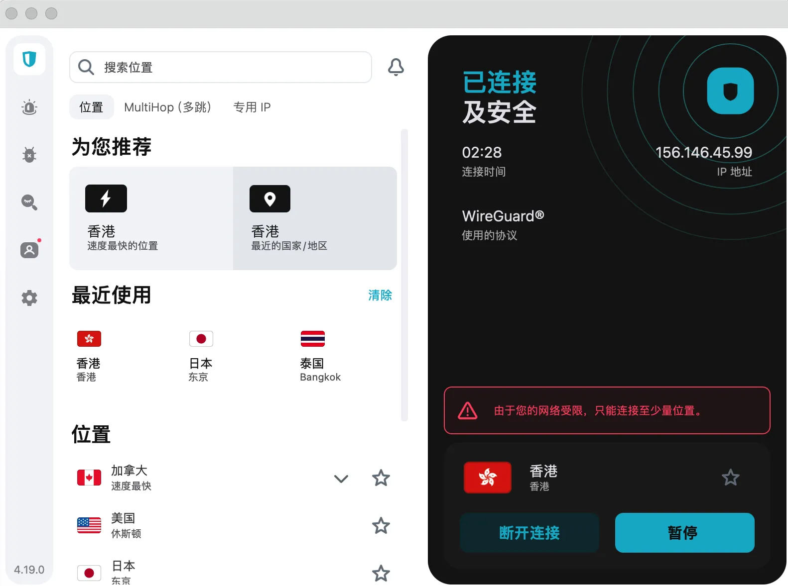
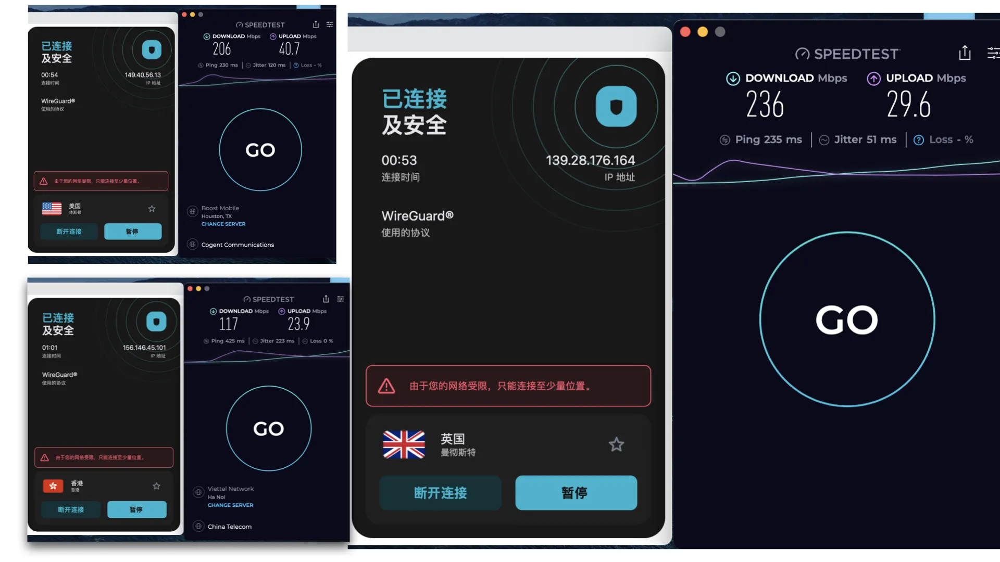
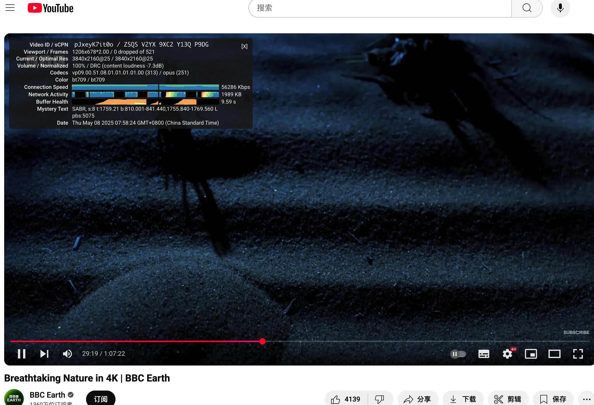
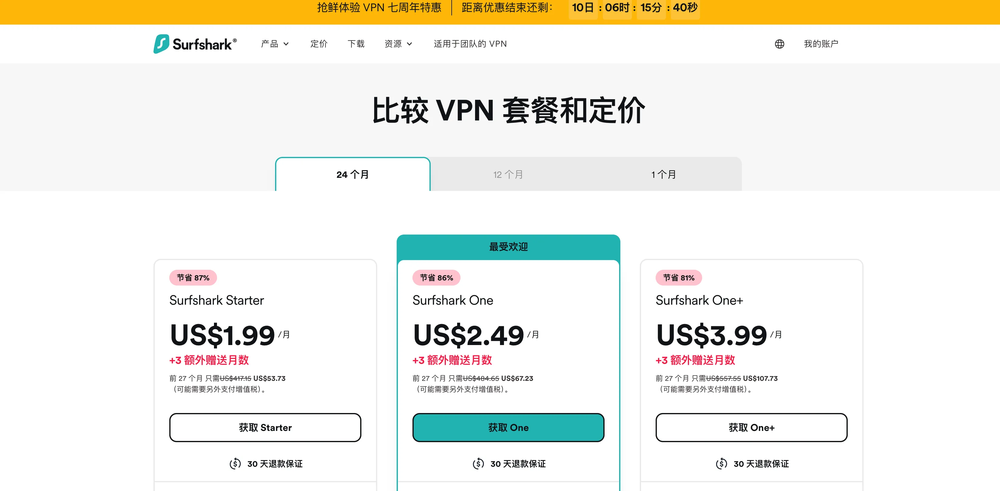

  <a href="https://get.surfshark.net/aff_c?offer_id=926&aff_id=38237" 
     target="_blank" 
     rel="noopener noreferrer"
     style="display: inline-block; background: linear-gradient(to right, #FFA000, #FFC107); color: #212121; padding: 14px 28px; font-size: 16px; border-radius: 10px; text-decoration: none; font-weight: bold; box-shadow: 0 4px 12px rgba(0,0,0,0.15); transition: all 0.3s ease;">
     🚀 点击进入 Surfshark 官网注册（限时立省 87% + 赠送 3 个月）
  </a>

## [Surfshark](https://get.surfshark.net/aff_c?offer_id=926&aff_id=38237) 2025 年在中国还好用么？
**非常好用!** 我亲自在 Mac、iPhone 和 Windows 上都试了一圈，体验非常顺畅。不用费劲设置，从 [Surfshark](https://get.surfshark.net/aff_c?offer_id=926&aff_id=38237) 官网下载安装好之后，登录账号，一键就能连接，非常简单。

有一点特别值得说的是，[Surfshark](https://get.surfshark.net/aff_c?offer_id=926&aff_id=38237) 会自动识别你是否身处网络受限区域。如果检测到，就会自动启用 NoBorders 模式 —— 这是专门为中国这种网络环境特殊的地方设计的，能帮你顺利穿透防火墙，连接非常稳。

⚠️ **重要提醒：千万别手动关闭 NoBorders 模式！**关掉之后也没关系,记得打开，不然可能就连不上 VPN 了。

我用下来发现，[Surfshark](https://get.surfshark.net/aff_c?offer_id=926&aff_id=38237) 提供的服务器节点挺多的，十几个国家和地区可以选。如果遇到高峰期有节点连不上，只要换一个重新连接一下就行。基本上两三次就能连上，我到现在还没遇到真正连不上的情况。无论是刷视频、上网页还是用社交软件，全程都很流畅。

## 什么是 [Surfshark](https://get.surfshark.net/aff_c?offer_id=926&aff_id=38237)？

### 品牌背景与发展概况
[Surfshark](https://get.surfshark.net/aff_c?offer_id=926&aff_id=38237) 成立于 2018 年，总部设在荷兰，虽然是 VPN 行业中的“新面孔”，但发展势头却非常迅猛。它由 Nord Security 控股——这家公司也拥有大家熟知的 NordVPN，这样的背景也让 [Surfshark](https://get.surfshark.net/aff_c?offer_id=926&aff_id=38237) 从起步阶段就具备了强大的技术和资源基础。

短短几年时间，[Surfshark](https://get.surfshark.net/aff_c?offer_id=926&aff_id=38237) 已经把服务拓展到了全球 100 多个国家，拥有超过 3,200 台服务器，足见其在市场上的成长速度和覆盖能力。

### [Surfshark](https://get.surfshark.net/aff_c?offer_id=926&aff_id=38237) 提供的核心服务
除了基础的 VPN 功能外，[Surfshark](https://get.surfshark.net/aff_c?offer_id=926&aff_id=38237) 还整合了多项实用工具，包括：

- **NoBorders**：自动绕过网络限制,无缝连接
- **CleanWeb**：自动屏蔽广告和恶意网站
- **Surfshark Alert**：实时监控数据泄露
- **Surfshark Search**：匿名搜索服务
- **Antivirus**：适用于 Windows 与 Android 的杀毒软件（需额外付费）

## 核心功能解析

### 跨平台兼容性与设备支持
[Surfshark](https://get.surfshark.net/aff_c?offer_id=926&aff_id=38237) 能覆盖几乎所有主流平台和设备，包括：

- 操作系统：Windows、macOS、Linux、Android 和 iOS

- 浏览器插件：Chrome 与 Firefox

- 智能设备与路由器：如 Fire TV、Apple TV、Android TV，以及各类支持 VPN 的路由器

另外，它的一大优势在于支持 不限数量的设备同时使用，这对家庭用户或小团队来说无疑更加实用、省心。

### 真正不限设备数的优势
市面上大多数 VPN 服务对设备连接数量都有限制（通常为 5 台），但 [Surfshark](https://get.surfshark.net/aff_c?offer_id=926&aff_id=38237) 则完全不设限。无论你有多少设备，只需一个账号就能全面加密，既方便又划算。

### CleanWeb 实测表现
在多个广告密集型网站进行测试后，我们发现 [Surfshark](https://get.surfshark.net/aff_c?offer_id=926&aff_id=38237) 的 CleanWeb 功能能有效屏蔽 90% 以上的弹窗广告及追踪器，大幅提升了日常浏览体验。

## 安全性分析

### 加密技术与协议支持
[Surfshark](https://get.surfshark.net/aff_c?offer_id=926&aff_id=38237) 支持以下协议和加密标准：

- AES-256-GCM 军规级加密
- WireGuard：轻量、高速、现代协议
- OpenVPN 和 IKEv2/IPSec

### 严格无日志政策
[Surfshark](https://get.surfshark.net/aff_c?offer_id=926&aff_id=38237) 明确表示不会记录用户的 IP 地址、浏览行为或连接时间。同时，它采用的是 RAM-only 服务器架构，也就是说每次重启后，所有数据都会自动清除，不留痕迹。

2023 年，它还通过了知名审计机构 Deloitte 的隐私政策独立审核，进一步增强了透明度与用户的信任感。

⚠️ 很多人可能没意识到，一些“免费 VPN”或来源不明的工具，其实可能暗藏风险。它们背后有时受政府或第三方操控，不仅偷偷记录你的活动，甚至可能在你毫不知情时泄露你的敏感信息。

🛡️ 而 [Surfshark](https://get.surfshark.net/aff_c?offer_id=926&aff_id=38237) 则完全不同。它公开拒绝任何数据调阅请求，并设立在法律上无数据强制保存要求的荷兰，真正实现了隐私保护的承诺。

### 高级安全功能：Kill Switch 与 MultiHop
- **Kill Switch**：当 VPN 连接断开时自动断网，避免 IP 泄露
- **MultiHop**：双重加密，数据通过两个国家的服务器中转，进一步提升隐私性

## 速度表现测试

### 各地服务器速度实测
我们在美洲、亚洲和欧洲等多个地区进行了速度测试。在开启 WireGuard 协议下，
下载速度稳定在 150-250 Mbps 之间，上传速度约为 20-40 Mbps，观看高清视频和下载大文件都无明显影响。
- Speedtest.net 多地区测试结果：

- Youtube 4K视频表现
  

### 流媒体平台兼容性
[Surfshark](https://get.surfshark.net/aff_c?offer_id=926&aff_id=38237) 成功解锁了多个平台，包括：

- Netflix（美/英）
- Disney+
- Hulu
- BBC iPlayer
- HBO Max

流媒体播放基本无卡顿，4K 清晰度表现流畅。

## 使用体验反馈

### 桌面与移动端界面比较
无论是在桌面还是移动设备上，[Surfshark](https://get.surfshark.net/aff_c?offer_id=926&aff_id=38237) 的界面都设计得简洁直观。桌面端提供了更多自定义选项，而手机端则偏向于一键连接，操作更快捷。

### 浏览器插件使用体验
[Surfshark](https://get.surfshark.net/aff_c?offer_id=926&aff_id=38237) 的 Chrome 与 Firefox 插件启动迅速，适合仅需加密浏览器活动的用户，特别适合在办公场景中使用。

## 客服支持能力

[Surfshark](https://get.surfshark.net/aff_c?offer_id=926&aff_id=38237) 提供 24/7 在线客服，搭配完善的知识库。在实测中，客服响应平均仅需 30 秒，回复内容专业且态度友好。

## 套餐价格与性价比分析

| 套餐类型 | 月均价格   | 优惠说明                   |
|----------|--------|------------------------|
| 月付方案 | $15.45 | 无折扣                    |
| 年付方案 | $3.19  | 总价约 $47.85,附送 3 个月          |
| 24 个月方案 | $1.99  | 总价约 $53.73,附送 3 个月，最划算 |

所有方案均提供 30 天无条件退款，适合先试后买。
这个价格可以说是相当能打了,配合易用性，无设备数量限制，高速下载能力，这安全性，性价比无敌了。

  <a href="https://get.surfshark.net/aff_c?offer_id=926&aff_id=38237" 
     target="_blank" 
     rel="noopener noreferrer"
     style="display: inline-block; background: linear-gradient(to right, #FFA000, #FFC107); color: #212121; padding: 14px 28px; font-size: 16px; border-radius: 10px; text-decoration: none; font-weight: bold; box-shadow: 0 4px 12px rgba(0,0,0,0.15); transition: all 0.3s ease;">
     🚀 点击进入 Surfshark 官网注册（限时立省 87% + 赠送 3 个月）
  </a>

### 与主要竞品对比

| VPN 名称     | 同时连接设备数 | 月均价格  | 速度表现 | 解锁 Netflix |
|--------------|----------------|-------|---------|---------------|
| Surfshark    | 无限            | $1.99 | 非常快    | 支持           |
| NordVPN      | 6 台           | $3.09 | 非常快        | 支持           |
| ExpressVPN   | 5 台           | $6.67 | 快       | 支持           |

## 隐私政策与法律合规性

[Surfshark](https://get.surfshark.net/aff_c?offer_id=926&aff_id=38237) 总部设在荷兰，不属于五眼、九眼或十四眼联盟国家范围，这也意味着它不受强制数据共享条约限制，能为用户提供更坚实的隐私保护。

其隐私政策内容明确，不会：

- 记录日志
- 收集浏览历史或搜索行为
- 存储 IP 地址与连接时间

加上 RAM-only 架构，[Surfshark](https://get.surfshark.net/aff_c?offer_id=926&aff_id=38237) 极大地降低了数据泄露风险。

## 用户口碑与平台评分

| 平台       | 用户评分（满分 5） | 用户评论亮点 |
|------------|--------------------|--------------|
| Trustpilot | 4.5                | 客服响应快、性价比高 |
| Reddit     | 多数正面           | 解锁能力强、界面清爽 |
| App Store  | 4.7                | 移动端连接稳定 |
| Google Play | 4.3               | 稳定性好、无广告 |

## 中国用户使用体验
由于中国的网络审查机制（GFW）不断加强，许多 VPN 在国内的连接体验不尽如人意。但 [Surfshark](https://get.surfshark.net/aff_c?offer_id=926&aff_id=38237) 的表现依旧稳健，展现出不错的适应能力：

- **Camouflage Mode**：能将 VPN 流量伪装成普通的 HTTPS 请求，避免被轻易识
- **NoBorders 模式**：自动判断网络环境，启用适合受限地区的连接配置
- **服务器节点定期更新**：持续优化线路，提高成功连接率并绕过封锁

## 常见问题（FAQs）

1. **[Surfshark](https://get.surfshark.net/aff_c?offer_id=926&aff_id=38237) 能解锁 Netflix 吗？**  
   能，支持多个地区 Netflix，无缓冲播放。

2. **[Surfshark](https://get.surfshark.net/aff_c?offer_id=926&aff_id=38237) 会记录我的数据吗？**  
   不会。它遵循严格的无日志政策，所有数据不留痕迹。

3. **最多能连接几台设备？**  
   无限。一个账号搞定全家设备。

4. **支持中文吗？**  
   支持。界面和官网都有完整中文版本。

5. **退款政策是怎样的？**  
   30 天内可无条件退款，适合先试再买。

6. **[Surfshark](https://get.surfshark.net/aff_c?offer_id=926&aff_id=38237) 和 NordVPN 有啥不同？**  
   两者同属一家公司，[Surfshark](https://get.surfshark.net/aff_c?offer_id=926&aff_id=38237) 主打性价比与无限连接，而 NordVPN 在高级功能和服务器数量上略胜一筹。

7. **连接不上怎么办?**
   先检查网络连接是否正常，检查NoBorders是否开启,多尝试其他节点,
   如果问题依然存在,这里提供手动连接教程[https://support.surfshark.com/hc/en-us/articles/12629532662802-Connecting-from-China](https://support.surfshark.com/hc/en-us/articles/12629532662802-Connecting-from-China)
9. 可以联系客服寻求帮助。

## 总结：[Surfshark](https://get.surfshark.net/aff_c?offer_id=926&aff_id=38237) 还值得买吗？

综合来看，[Surfshark](https://get.surfshark.net/aff_c?offer_id=926&aff_id=38237) 在 2025 年依然是一款功能全面、价格实在、隐私保障到位的 VPN：

✅ 支持无限设备  
✅ 解锁主流流媒体平台  
✅ 强加密技术+无日志政策  
✅ 客服反应快、中文友好  
✅ 套餐便宜、退款无忧

对于追求高性价比、又不想在安全和体验上妥协的用户来说，[Surfshark](https://get.surfshark.net/aff_c?offer_id=926&aff_id=38237) 依旧是一款值得信赖的 VPN 选择。

---

## 📚 推荐阅读｜拓展你的翻墙工具知识

- [🔐 VPN 推荐榜单（2025 最新实测）](https://gptvpnhelper.com/network-access/)  
  详细对比 Surfshark、NordVPN、StrongVPN 等热门服务在中国的连接表现。

- [✈️ 2025 科学上网机场推荐与评测](https://gptvpnhelper.com/airport-access/)  
  收录多个稳定高速机场服务，适配 Clash、V2Ray 等工具，适合长期翻墙使用。

- [📝 ChatGPT 海外账号注册教程（不踩坑指南）](https://gptvpnhelper.com/chatgpt-register-guide/)  
  教你如何在国内成功注册 ChatGPT，解决手机号、邮箱、IP 等问题。

- [💳 ChatGPT Plus 升级付费指南](https://gptvpnhelper.com/chatgpt-plus-guide/)  
  使用虚拟卡成功升级ChatGPT Plus，解锁 ChatGPT-4.5,o3模型。

- [📘 中文导航主页｜ChatGPT、VPN、机场合集入口](https://gptvpnhelper.com)  
  整理所有教程与资源，适合新手入门或老手查阅备用。

- [📘 ChatGPT最佳实践以及使用技巧](https://gptvpnhelper.com/guide/)
  由 ChatGPT 中文助手导航站维护，**涵盖 ChatGPT 注册、Plus 升级、Prompt 模板、Explorer GPT、DALL·E/Sora 使用技巧等内容，适合新手与进阶者，帮助你全面掌握 ChatGPT 的使用方法。**

---

📬 本项目由 [chatgpt-helper-tech](https://github.com/chatgpt-helper-tech) 维护，面向中文用户持续更新  
📂 ChatGPT 中文助手导航站 主站地址：[https://gptvpnhelper.com](https://gptvpnhelper.com)  
⭐ 创作不易,如果你觉得本站有帮助，请点击 Star⭐ 或分享给有需要的朋友
---
