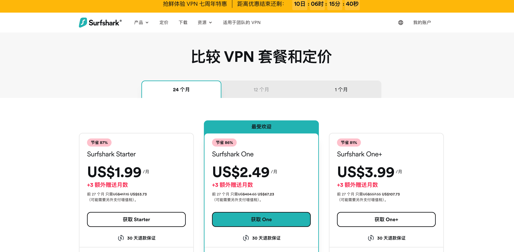

## 📖 目录

- [❓ 为什么一定要用 VPN?（场景越多，越刚需）](#whyneedvpn)
- [🥊 VPN vs SS/Clash 机场：全面对比，谁更适合你？](#-vpn-vs-ssclash-机场全面对比谁更适合你)
- [🎯 购买 VPN 前，必须掌握的 9 项关键指标（避坑指南）](#-购买-vpn-前必须掌握的-9-项关键指标避坑指南)
- [🆓 免费跳板推荐：V2Free 免费机场](#-免费跳板推荐v2free-免费机场)
- [🛡️ 深度评测：2025 年度 VPN 服务 TOP5](#fivebestvpn)
   - [1. StrongVPN 推荐指数:⭐️⭐⭐⭐⭐](#strongvpn)
   - [2. NordVPN    推荐指数:⭐️⭐⭐⭐⭐](#nordvpn)
   - [3. ExpressVPN 推荐指数:⭐️⭐⭐⭐](#3-expressvpn)
   - [4. Surfshark  推荐指数:⭐️⭐⭐⭐](#4-surfshark)
   - [5. Private Internet Access (PIA) 推荐指数:⭐️⭐⭐](#pia)

- [📊 VPN 对比一览](#-vpn-对比一览)
- [📚 推荐配套教程](#-推荐配套教程)
  
---
## 🌐 2025 年度最推荐 VPN 工具榜单

欢迎来到 ChatGPT 中文助手站点旗下的 VPN 推荐实测项目！

本项目目的是帮助你**轻松突破网络限制、告别访问障碍**，真正畅享 ChatGPT、Google、YouTube、GitHub、Notion、Netflix 等全球顶级平台所带来的学习、影视、游戏与工作自由。

无论你是开发者、AI从业者、出海创业者，还是只是想看看 Netflix 或注册 ChatGPT 的普通用户——你都将发现：  
> **没有 VPN，你连迈出第一步都很难。**

因此，我们根据以下关键指标对主流 VPN 工具进行了实测横向评测，并附上**详细注册与购买教程**：

- 访问稳定性与抗封锁能力  
- 网络速度与视频流畅度  
- 多设备兼容性（Win / Mac / iOS / Android / 路由器）  
- 匿名性与隐私保护  
- 是否支持 ChatGPT / Claude / API 调用  

**只推荐真正可用、靠谱、值得信赖的 VPN 工具**，让你在 2025 年，畅享真正的数字自由。

---

## ❓ 为什么一定要用 VPN？（场景越多，越刚需）

> **一句话总结：VPN 是数字世界的万能通行证。没有它，你寸步难行；有了它，世界皆通。**

我们不是在危言耸听，而是想问你几个简单的问题：
- 百度上搜不到答案？知乎水帖刷屏？国内平台“信息围城”越来越严重,Google 用不了?
- 你是不是连 ChatGPT 网页都打不开？  
- 想看 YouTube,Netflix，却一直提示“无法连接”？  
- GitHub 下载一个仓库，结果超时 3 次？  
- 论文查找、AI 模型获取，打不开 Hugging Face、arXiv？  
- Steam 区锁 DLC 买不了、Ping 高延迟爆炸？  
- AWS Console 登录异常，Stripe/Paddle 无法绑定虚拟卡？

这一切，**不是你电脑的问题**，而是网络环境对你关上了门。

而 VPN，就是那把专属你的钥匙。

---

| 🧱 典型使用场景 | 🚫 常见受限现象 | ✅ 使用 VPN 后能做什么 |
|----------------|------------------|------------------------|
| **AI 与开发** | ChatGPT / Claude / GitHub Copilot 无法登录、响应超时 | 注册 ChatGPT、订阅 Plus、调用 API、拉取 GitHub 仓库 |
| **影视娱乐** | Netflix / Disney+ / Hulu / HBO Max 显示区域限制、加载失败 | 解锁全球流媒体；看 YouTube 4K/8K、B站港澳台番剧 |
| **搜索学习** | Google Scholar / arXiv / Hugging Face 403 拒绝访问 | 自由查阅英文论文、下载 AI 模型、访问国外开发文档 |
| **远程办公** | Zoom、Slack、Trello 掉线、同步失败 | 稳定视频会议、实时协作、Jira 工单不卡顿 |
| **支付/电商** | PayPal、Stripe、AWS 登录异常，虚拟卡绑不上 | 成功绑定外币卡，顺利管理云服务、下单跨境电商平台 |
| **跨国游戏** | Steam 国区锁，Ping 高、DLC 无法购买 | 解锁国际服内容、低延迟匹配、畅玩全球限定游戏 |

---

## 🧠 小结

如果你还在靠“免费机场”勉强访问 ChatGPT；  
如果你每次看 Netflix 都要碰碰运气；  
如果你买了台好电脑，却连一个 GitHub 项目都下不来；  

那是时候认真对待“VPN”这件事了。

**选择对的 VPN，不只是更快更稳——而是让你彻底摆脱卡顿、封锁、和信息落差。**

👉 接下来，我们将带你深入了解 2025 年最值得使用的 VPN 工具，帮你**选得放心、用得安心、买得划算！**

---

## 🥊 VPN vs SS/Clash 机场：全面对比，谁更适合你？

很多人在选择“科学上网”方案时，会纠结 VPN 和机场（SS/V2Ray/Clash）哪个更好用？下面我们从安全性、稳定性、易用性、隐私保护等关键维度做一个一目了然的对比：

| 维度 | VPN（国际付费商业服务） | SS/V2Ray 机场（国内订阅节点） |
|------|--------------------------|-------------------------------|
| **流量加密** | ✅ 系统级全流量加密（AES-256，协议如 OpenVPN / WireGuard / Lightway），强抗封锁 | ⚠️ 多为单端口节点，易被 GFW DPI 主动识别封锁 |
| **使用门槛** | ✅ 一键安装，免配置，iOS/Android/Win/Mac/路由器全支持 | ❌ 需手动导入订阅、设置 Clash 或 Shadowrocket，新手易踩坑 |
| **连接稳定性** | ✅ 企业级专线 + 全球智能选路，断线自动重连 | ⚠️ 节点质量不一，依赖机场主维护，晚高峰不稳定 |
| **同时连接设备** | 5–∞（取决于套餐，支持家庭/多设备共享） | 视机场限制，一般 2–5 个并发连接 |
| **隐私与合规** | ✅ 多数 VPN 通过第三方隐私审计，受欧美 GDPR 监管，无日志保障 | ❌ 多为匿名搭建，无审计、无说明、无保障，跑路风险高 |
| **适合人群** | 新手用户、留学跨境、程序员、AI内容创作者、跨境电商 | 技术玩家、下载党、测试党、备用选项 |
| **典型月费** | $2.3 – $12 / 月（长约折扣价） | ¥9 – ¥49 / 月（波动大，质量参差不齐） |

---

### 💡 专业建议：VPN 打通主干网，机场适合做补充

> 🚀 **最佳实践：使用 VPN 注册 ChatGPT / 绑定 PayPal / 解锁 Netflix**  
> 📥 **再根据需求，用机场下载资源 / 作为备用线路**

如果你是新手、跨境用户、内容创作者、AI开发者——**优先选 VPN 保命+省心+效率高**  
等熟练后可考虑搭配优质机场，实现“主干 VPN + 末端机场”双重保障，速度和自由都不落下！
附上2025最新机场推荐评测:[✈️ 2025 机场推荐 科学上网](https://gptvpnhelper.com/airport-access/)

---

📌 **结论很简单：**
- 想稳定、长期、安全，选大牌 VPN
- 想便宜、折腾、有备选，机场能用但风险自担

---

## 🎯 购买 VPN 前，必须掌握的 9 项关键指标（避坑指南）

市面上 VPN 品牌众多，但真正适合中国大陆用户的，其实不到 10%。如果你不想买完就封、用两天就卡、退款又麻烦，**请在下单前务必确认以下 9 项核心指标：**

---

1. **是否能稳定解锁 ChatGPT / Netflix / YouTube？**
   > 不只是能打开官网，而是能长时间保持连接、支持注册、付款、升级 Plus、不被封 IP。

2. **协议与速度表现如何？**
   > 是否支持 OpenVPN / WireGuard / Lightway / NordLynx 等现代协议？是否具备自研或私有加速协议以应对 GFW？

3. **全球服务器网络布局是否够广？**
   > 国家和地区节点是否丰富？是否设置专用的流媒体 / P2P 下载 / 游戏低延迟服务器？

4. **隐私政策是否可信？**
   > 是否明确“零日志”声明？有没有通过 **第三方独立审计**？是否采用 **RAM-only Server**（重启即清除数据）？

5. **是否对中国友好？**
   > 是否支持混淆协议、防 DPI？是否提供**镜像站**、离线安装包，解决“官网打不开”的尴尬？

6. **支持的终端数量和设备兼容性？**
   > 同时连接是 5 台还是无限？是否支持路由器、Apple TV、PS5、安卓盒子等多设备？

7. **附加功能是否实用？**
   > 如广告拦截、恶意域名屏蔽、Split Tunneling（分应用走代理）、专属 IP、端口转发等增强功能。

8. **价格合理 + 是否支持无理由退款？**
   > 支持月付/年付组合？有无 30 天退款保障？是否接受支付宝、虚拟卡、USDT 等灵活支付方式？

9. **是否提供中文客服与文档？**
   > 是否有 24×7 在线客服 / 邮件支持？技术文档是否对中文用户友好？是否有本地部署指引？

---

📌 **购买建议：**  
如果一个 VPN 连上述 3 项都无法满足，那就别买。别因为几块钱被卡得发疯。  
靠谱 VPN = 稳定穿墙 + 流畅体验 + 无痛退款。

👉 在下一节中，我们将推荐通过全部验证的 VPN 工具 —— 实测可用，长期稳定。

---

## 🆓 免费跳板推荐：V2Free 免费机场

如果你连 VPN 官网或 ChatGPT 都打不开，我们推荐你先用一个免费的机场作为跳板,每日可领取免费流量,内含教程：

👉 [注册免费科学上网 V2free（每日免费流量 · 即可访问 ChatGPT 官网）](https://w1.v2free.cc/auth/register?code=i0A3)

- 此机场作者已使用了2年多,可免费使用也可购买套餐,便宜稳定
- 支持 Clash、V2rayN 导入
- 每日免费流量
- 可用于访问 ChatGPT、YouTube、GitHub、VPN 官网等

---

## 🛡️ 深度评测：2025 年度 VPN 服务 TOP5

下面汇总了五款精选 VPN（StrongVPN、NordVPN、ExpressVPN、SurfShark、Private Internet Access）的详细参数与实测表现，帮助你快速选出最适合访问 ChatGPT、YouTube、GitHub 等海外服务的方案。

---

### 1. [StrongVPN 安全稳定老牌厂商,新用户立享6.6折](https://strongvpn.com/?tr_aid=68066b25e52d2)

<noscript>
<h2><a href="https://strongvpn.com/">STR 2020</a></h2>
</noscript>

**简介**
- StrongVPN 成立于 2005 年，是一家在 VPN 行业拥有近 20 年历史的老牌公司，起初是作为一家为消费者提供网络硬件和互联网服务的公司而创立的，
后来逐步转型为专注于在线隐私保护的 VPN 服务商。它目前隶属于 J2 Global（现为 Ziff Davis）旗下的品牌集合，与 IPVanish、Encrypt.me 等其他网络安全品牌同属一家公司。
这是美国一家老牌的数字媒体和网络安全上市公司,纳斯达克股票代码为:NASDAQ: ZD。
Ziff Davis 拥有大量技术资源，并在网络安全、电子邮件、媒体出版等多个领域具有布局。
上市公司背景意味着财务信息透明、合规审查严格，增强 StrongVPN 的可靠性。

**安全与加密**
StrongVPN 提供了行业标准的安全功能，包括：
- **256 位 AES 加密**：确保用户数据在传输过程中的安全性。
- **无日志政策**：StrongVPN 承诺不记录用户的活动日志，增强用户的隐私保护。
- **自动断线保护（Kill Switch）**：在 VPN 连接意外断开时，自动切断互联网连接，防止数据泄露。
- **多种协议支持**：包括 WireGuard、IKEv2、OpenVPN 和 IPSec 等，满足不同用户的需求。

**隐私保护**  
- 无日志政策，总部位于美国，但因无存储日志而难以被法令索取。

**网络规模**  
- StrongVPN 在 42 个国家部署了 950 多台服务器，覆盖全球多个地区，如中东、亚洲和澳大利亚等，以及新加坡和中国台湾（台北）。
- 所有服务器均支持 P2P 下载，适合进行种子下载等活动。
- 此外，StrongVPN 提供智能 DNS 功能（StrongDNS），可在不支持 VPN 的设备上观看流媒体服务。

**速度实测**
在性能方面，StrongVPN 提供稳定的连接和良好的速度表现，特别是在本地服务器上。对于大多数日常使用，如浏览网页和观看高清视频，StrongVPN 能够提供流畅的体验。
- WireGuard：270–300 Mbps（美国节点），450–500 Mbps（英国节点）
- IKEv2：260–280 Mbps
- OpenVPN：230–240 Mbps

**流媒体解锁**  
- StrongVPN 对于 P2P 下载提供良好的支持，适合进行种子下载等活动
- 在解锁流媒体平台方面，StrongVPN 支持 Netflix、Hulu 和 Disney+ 等热门主流流媒体网站。

**P2P 与 Torrent**  
- 所有服务器均允许 P2P，附赠 250 GB SugarSync 云存储，用于文件备份。

**用户体验与设备兼容性**
- StrongVPN 提供适用于 Windows、macOS、iOS 和 Android 等平台的应用程序，安装简便，界面友好，适合各类用户使用。
- 一个 StrongVPN 账户支持同时连接最多 12 台设备，适合家庭或小型团队共享使用。
- 此外，StrongVPN 的应用程序支持中文显示，方便中文用户使用。

**特色功能**
- SugarSync 云存储（250 GB）
- 支持最多 12 台设备同时连接
- 全套路由器安装指南

**🧑‍💼 客户支持**
- StrongVPN 提供多渠道的客户支持，包括电子邮件和在线帮助中心。用户反馈普遍对其响应速度和解决问题的效率表示满意。

**价格方案**
- 年付：$3.98/月（$47.69/年）
- 月付：$11.99/月
- **提供 30 天退款保障（仅限于年度套餐），用户可以在试用期间申请全额退款，降低购买风险。**

**优点**
- 云存储附加值
- 多平台支持
- 稳定的 P2P 体验

**缺点**
- 节点数量相对较少
- WireGuard 速度低于顶级对手
- 缺少浏览器扩展

| **StrongVPN** 👉 [点击前往官网注册,享6.6折优惠](https://strongvpn.com/?tr_aid=68066b25e52d2) |

---

### 2. [NordVPN 最受欢迎的VPN服务](https://get.affiliatescn.net/aff_c?offer_id=153&aff_id=122265&url_id=613)

**简介**
NordVPN 成立于 2012 年，由三位朋友在 拉脱维亚 创办，他们当时的目标是创建一个能够保护用户在线隐私和安全的 VPN 服务。这些创始人深受网络安全和隐私保护问题的启发，决心为全球用户提供一个快速、安全、可靠的解决方案。
NordVPN 是全球领先的虚拟私人网络（VPN）服务提供商之一，以其卓越的安全性、隐私保护、以及高效的性能而闻名。
NordVPN 由 Tefincom & Co., S.A. 公司开发和运营，成立至今，已经成为全球数百万用户的首选 VPN 服务商。其强大的加密技术、全球服务器网络和用户友好的应用界面，使其成为安全上网的可靠伙伴。

****顶级隐私与安全保护****  
NordVPN 是全球用户隐私安全的守护者。它采用行业领先的 **256 位 AES 加密**，确保所有数据在传输过程中都被强力保护。其安全性能达到业界标准，无论你是进行在线购物、银行交易，还是浏览敏感信息，都可以保证数据的加密和隐私安全。
- **DNS 泄露保护和 Kill Switch**：如果 VPN 连接意外中断，Kill Switch 会立刻切断所有网络流量，避免泄露用户的真实 IP 地址。此外，DNS 泄漏保护确保任何请求都通过安全的 NordVPN 服务器，而不会暴露给 ISP（互联网服务提供商）。
- **CyberSec 防护**：该功能可自动阻止恶意网站和广告，避免潜在的网络攻击和不必要的广告干扰。

**隐私保护**  
- **无日志政策**：NordVPN 承诺不记录任何用户活动日志，这一点非常重要，尤其对于那些对隐私要求极高的用户。此政策通过外部审计来验证，以确保其真实有效。

**网络规模**  
NordVPN 拥有 **5500 多个服务器**，分布在全球超过 **60 个国家**，这使得它在任何地区都能提供高速和稳定的 VPN 服务。无论你身处何地，NordVPN 都能提供最佳的连接体验。
- **服务器位置**：从美国、加拿大、英国、澳大利亚到亚洲和南美，NordVPN 拥有覆盖全球的高速服务器，支持 **P2P 下载** 和 **流媒体访问**。
- **智能连接选择**：用户可以选择连接到最适合自己位置的服务器，或通过特定的国家来解锁流媒体平台内容。

**速度实测**  
NordVPN 在全球的服务器网络优化方面做得非常出色，提供超快的连接速度。无论是日常浏览、在线游戏还是大流量的文件下载，NordVPN 都能提供令人满意的速度。
- **OpenVPN 和 WireGuard**：NordVPN 支持 OpenVPN 和 WireGuard 协议，后者特别优化了速度和连接稳定性，适合需要高速连接的用户。
- **快速全球连接**：NordVPN 的全球服务器优化保证了用户能够获得最快的连接速度，尤其适合游戏玩家和需要稳定连接的流媒体观众。
- **使用 NordLynx 协议，速度可达 480–520 Mbps，延迟 <20 ms，稳定性优秀。**

**流媒体解锁**  
流媒体是 NordVPN 的一大亮点，尤其是在 Netflix、Hulu、BBC iPlayer 等平台的解锁能力上。NordVPN 通过其全球服务器网络，可以绕过地理限制，让你在任何地方都能观看你喜欢的内容。
- **Netflix 解锁**：NordVPN 支持解锁美国、英国、加拿大等多个地区的 Netflix，轻松享受全球海量影视资源。
- **Amazon Prime、Hulu 和 Disney+**：无论你在哪个国家，NordVPN 都能确保流媒体平台的顺畅播放，完全消除因地域限制而无法观看的困扰。
- **快速服务器支持**：NordVPN 在流媒体优化方面表现出色，确保用户能够以最快的速度进行观看，避免缓冲和延迟。

**P2P 与 Torrent**  
- **支持所有标准节点的 P2P，内置 Kill Switch，配合 SOCKS5 代理可进一步提升下载速度。**

**特色功能**
- **Threat Protection**：这一功能可以防止恶意软件的下载，并提供实时广告拦截，进一步提升在线安全性。
- **专用 IP**：NordVPN 提供专用 IP 地址服务，适合那些有特殊需求的用户，如在线银行或远程工作。
- **双重 VPN**：将用户的流量经过两个 VPN 服务器进行加密，为那些对隐私要求极高的用户提供额外的保护层。

**价格方案**
- 两年套餐：$3.09/月
- 一年套餐：$4.99/月
- 月付：$12.99/月
- **NordVPN 提供 **30 天无条件退款保障**，如果你对服务不满意，可以在 30 天内申请全额退款，避免任何风险。**

**NordVPN 的用户支持**
- NordVPN 提供 24/7 全天候的客户支持服务，用户可以通过其网站的聊天窗口、电子邮件或电话联系支持团队。其响应迅速且专业，能够帮助用户解决各种问题。
- **自助支持**：官网提供丰富的 FAQ 和指南，帮助用户自行解决常见问题。
- **实时聊天支持**：通过实时聊天功能，用户可以快速与支持人员沟通，解决技术问题。

**优点**
- 功能最全面
- 节点数量丰富
- 出色的 P2P 和流媒体表现

**缺点**
- 短期方案价格较高

| **NordVPN**  👉 [点我获取限时优惠]( https://get.affiliatescn.net/aff_c?offer_id=153&aff_id=122265&url_id=613) |

---

### 3. [ExpressVPN](https://www.expressvpn.com/)

**安全与加密**  
ExpressVPN 采用 256‑bit AES 加密 和 ChaCha20 算法，支持 OpenVPN（TCP/UDP）、IKEv2/IPSec 以及自研的 Lightway 协议。Lightway 以速度快、连接稳定著称，还提供 NAT 心跳功能，提升移动端通知及时性。

**隐私保护**  
坚持严格的无日志政策，并已通过多次独立审计。所有服务器均运行在 RAM-only 架构上，一断电即清除所有数据，彻底防止日志泄露。

**网络规模**  
在 94+ 个国家/地区拥有 3000+ 台服务器，覆盖 160 多个城市。全球节点丰富，可就近连接以获得最佳速度。

**速度实测**  
在千兆线路测试中，ExpressVPN 的平均速度损耗不足 10%，大多数地区下载速度可达 450–500 Mbps，延迟极低。

**流媒体解锁**  
可稳定解锁 Netflix、Disney+、Amazon Prime Video、BBC iPlayer、Hulu 等主流流媒体平台。

**特色功能**  
- MediaStreamer DNS：智能解锁不支持客户端的设备（如智能电视、游戏机）  
- Split Tunneling：可针对特定应用或域名选择走 VPN 或直连

**价格方案**  
- 年付：$6.67/月（含 49% 折扣 + 3 个月免费）  
- 月付：$12.95/月  
- 全部套餐均享 30 天无理由退款保障

**优点**  
- 顶级速度与稳定性  
- 行业领先的安全架构与审计  
- 杀手级流媒体解锁能力

**缺点**  
- 价格偏高  
- 不内置广告/恶意软件拦截
  
| **ExpressVPN**  👉 [点击注册](https://www.expressvpn.com/) |

 
---

### 4. [Surfshark](https://surfshark.com/zh)

**安全与加密**  
Surfshark 使用 256‑bit AES‑GCM 加密，支持 WireGuard、OpenVPN、IKEv2/IPSec 协议。内置 CleanWeb 广告和恶意网站拦截，提供 MultiHop（双 VPN）和 NoBorders 模式，自动规避审查。

**隐私保护**  
严格无日志，经独立安全团队审计，支持加密货币和苹果礼品卡支付，保障最高匿名性。

**网络规模**  
在 100+ 个国家/地区运营 3200+ 台服务器，所有服务器均允许 P2P 流量。

**无限设备连接**  
支持无限台设备同时登录，家庭和多设备用户理想之选。

**速度实测**  
基于 WireGuard，下载速度平均可达 400+ Mbps，高清视频流畅无缓冲。

**流媒体解锁**  
可稳定访问 Netflix、HBO Max、BBC iPlayer、Disney+、Amazon Prime 等。

**特色功能**  
- Bypasser（分流）：为特定网站或应用排除 VPN  
- IP Rotator：定时更换 IP，提升匿名性  
- Smart DNS：兼容不支持 VPN 的设备

**价格方案**  
- 两年套餐：$2.49/月（含 30 天退款）  
- 一年套餐：$3.99/月  
- 月付：$12.95/月

**优点**  
- 极高性价比  
- 无设备数量限制  
- 功能丰富，适合进阶用户

**缺点**  
- 部分高级功能对新手略显复杂

| **Surfshark**  👉 [点击注册](https://surfshark.com/zh) |

---

### 5. [Private Internet Access (PIA)](https://www.privateinternetaccess.com/)

**安全与加密**  
支持 AES‑128 和 AES‑256 加密，提供 WireGuard、OpenVPN、IKEv2/IPSec 协议。内置 MACE 广告/恶意软件拦截，支持 SOCKS5 代理和端口转发。

**隐私保护**  
严格无日志，多次司法审查中未留任何敏感数据。所有客户端开源，接受社区监督。

**网络规模**  
35000+ 台服务器，覆盖 91 个国家/地区，并配置专门 P2P 优化节点。

**无限设备连接**  
支持无限台设备同时使用。

**速度实测**  
WireGuard 下速度可达 400+ Mbps，OpenVPN 下稳定在 200–300 Mbps。

**流媒体解锁**  
兼容 Netflix、Hulu、Amazon Prime、BBC iPlayer。

**特色功能**  
- 定期发布透明度报告  
- 支持匿名加密货币支付  
- 高度可自定义客户端

**价格方案**  
- 两年套餐：$2.03/月  
- 一年套餐：$3.33/月  
- 月付：$11.95/月

**优点**  
- 隐私审计背书强  
- 超高性价比  
- 强大的 P2P 性能

**缺点**  
- 公司总部在美国（受 5/9/14 眼联盟影响）  
- 高级配置对非技术用户略有门槛

| **PIA VPN** 👉 [点击注册](https://www.privateinternetaccess.com/) |

---

## 📊 VPN 对比一览

| 服务      | 加密算法       | 协议支持                      | 服务器覆盖           | 连接数        | 价格（长期）      | 流媒体解锁       | P2P 支持       | 特色功能                                       |
|-----------|---------------|------------------------------|----------------------|--------------|------------------|-----------------|----------------|------------------------------------------------|
| ExpressVPN| AES-256,ChaCha20 | Lightway, OpenVPN, IKEv2    | 3000+／94+ 国       | 8            | \$6.67/月（年付）| 顶级（Netflix 等）| ✅             | TrustedServer, MediaStreamer, Split Tunneling |
| Surfshark | AES-256-GCM   | WireGuard, OpenVPN, IKEv2    | 3200+／100+ 国      | ∞            | \$2.49/月（2年） | 优秀（Netflix、HBO）| ✅             | CleanWeb, MultiHop, IP Rotator, Smart DNS     |
| NordVPN   | AES-256-GCM   | NordLynx, OpenVPN, IKEv2     | 6000+／111+ 国      | 10           | \$3.09/月（2年） | 优秀（全平台）     | ✅             | Threat Protection, Meshnet, Onion Over VPN    |
| PIA       | AES-128/256   | WireGuard, OpenVPN, IKEv2    | 35000+／91+ 国      | ∞            | \$2.03/月（2年） | 良好（大多数）    | ✅             | PIA MACE, Port Forwarding, Open Source        |
| StrongVPN | AES-256       | WireGuard, OpenVPN, IKEv2    | 950／30+ 国         | 12           | \$3.66/月（年付）| 良好（Netflix）| ✅             | SugarSync (250 GB), Router Guides             |

---

## 📚 推荐配套教程

- [📝 ChatGPT 注册教程](https://gptvpnhelper.com/chatgpt-register-guide/)
- [💳 ChatGPT Plus 升级教程](https://gptvpnhelper.com/chatgpt-plus-guide/)
- [✈️ 2025 机场推荐 科学上网 ](https://gptvpnhelper.com/airport-access/)
- [📘 ChatGPT 中文主站导航](https://gptvpnhelper.com)

---

📬 本项目由 [chatgpt-helper-tech](https://github.com/chatgpt-helper-tech) 维护，面向中文用户持续更新  
📂 GitHub Pages 主站地址：[https://gptvpnhelper.com](https://gptvpnhelper.com)  
⭐ 如果你觉得本站有帮助，请点击 Star 或分享给有需要的朋友  
---
